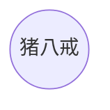
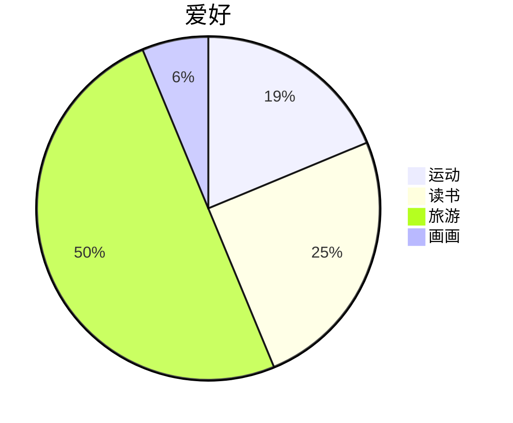
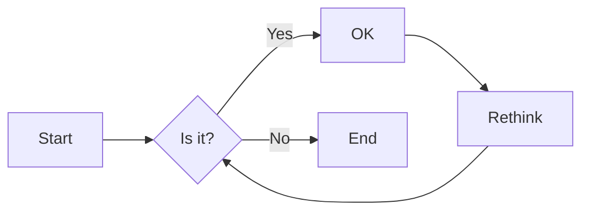
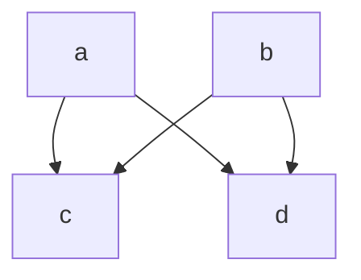
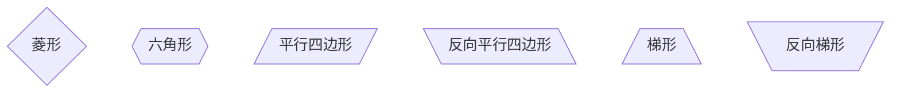
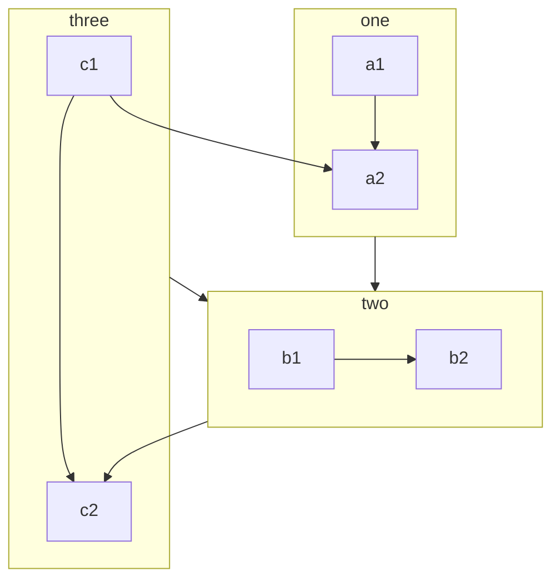

# Mermaid｜代码绘图

Mermaid 是基于 JavaScript 的绘图工具，可以通过代码创建图表。Markdown 编辑器 Typora 集成了 Mermaid 渲染功能，博客的 [mkdocs](https://squidfunk.github.io/mkdocs-material/reference/diagrams/) 主题也支持 Mermaid 图表 ໒(＾ᴥ＾)७

绘图类型概览: 饼状图 `pie`，流程图 `graph`，序列图 `sequenceDiagram`，甘特图 `gantt`，类图 `classDiagram`，状态图 `stateDiagram`，用户旅程图 `journey`

语法学习参考[官方文档](https://mermaid.js.org/intro/syntax-reference.html)



## 饼状图

```tex
pie
	title 爱好
	"运动": 15
	"读书": 20
	"旅游": 40
	"画画": 5
```



## 流程图

```tex
graph LR
	A[Start] --> B{Is it?};
	B -- Yes --> C[OK];
	C --> D[Rethink];
	D --> B;
	B -- No --> E[End];
```



方向:

- `graph` / `graph TB` / `graph TD` 从上往下
- `graph BT` 从下往上
- `graph LR` 从左往右
- `graph RL` 从右往左

连线:

- 实线 `a --> b -- 文字 --> c`
- 虚线 `a -.-> b -. 文字 .-> c`

- 无箭头 `a --- b`

- 多重链 `a & b --> c & d`



结点名及形状:

```tex
graph
    默认方形
    id1[方形]
    id2(圆边矩形)
    id3([体育场形])
    id4[[子程序形]]
    id5[(圆柱形)]
    id6((圆形))
```


```tex
graph
	id1{菱形}
	id2{{六角形}}
	id3[/平行四边形/]
	id4[\反向平行四边形\]
	id5[/梯形\]
	id6[\反向梯形/]
```



### 子图

用 `flowchart` 关键字，代码块用 `subgraph-end` 包围




---

Reference

[知乎｜Mermaid入门](https://zhuanlan.zhihu.com/p/355997933)