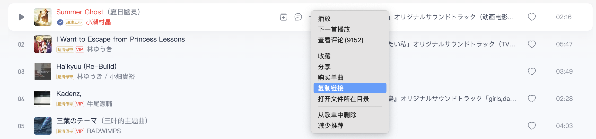

# 网易云音乐下载 MP3

下载链接: `http://music.163.com/song/media/outer/url?id=<输入id>.mp3`

然后在 App 复制歌曲链接

会得到 `https://music.163.com/song?id=1930226368&uct2=U2FsdGVkX1/J/ptk1Xg24fbIDI4z82Tn3OmZ2hRQIL0=` , `id` 就是 `1930226368`

把上面的 `id` 换成这个 `id` , 在浏览器打开, 就可以下载了.

---

**Reference**

[博客园 | 16.网易云音乐下载本地mp3攻略](https://www.cnblogs.com/kangkangfive/p/19070764)
