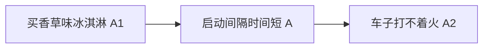
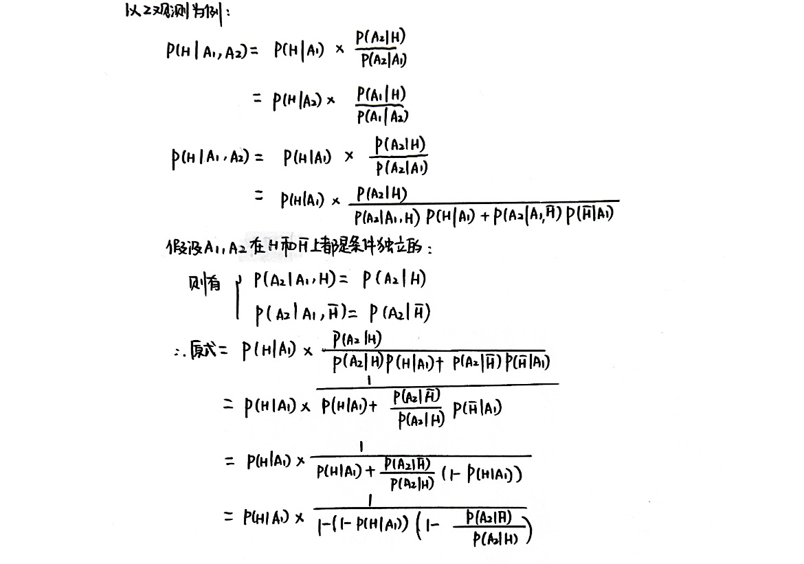
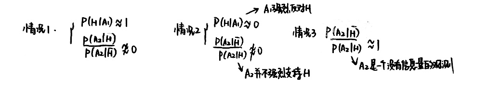
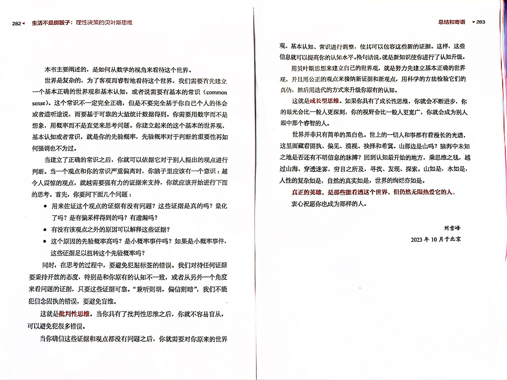

# 信号处理与信息推断

## 贝叶斯定理

### 条件概率

$P(A|B)$ : 在 $B$ 成立的条件下，$A$ 发生的概率

### 贝叶斯定理

$$
P(A|B) = \frac{P(A)P(B|A)}{P(B)}
$$

用于信息推断时:
$$
P(原因i | 观测的现象) = \frac{P(原因i) \times P(观测的现象|原因i)}{P(观测的现象)}
$$
$P(原因i | 观测的现象)$ 称为**后验概率**

$P(原因i)$ 通常称为**先验概率**

$P(观测的现象|原因i)$ 称为**似然概率**

### 奥卡姆剃刀 (Occam's Razor)

**描述:** **如非必需，勿增实体。**

> *More things should not be used than are necessary.*
>
> Albert Einstein: *Everything should be made as simple as possible, but not simpler.*

应用: 如果多个原因都可以很好地解释某个观测的现象，那么应该选择最简单的原因

- 都可以很好地解释: $P(观测的现象|原因i)$ 都近似于 $1$
- 最简单的原因: 往往有 $P(原因i)$ 最大

### 汉隆剃刀 (Hanlon's Razor)

描述: **能用愚蠢解释的，就不要解释为恶意**

> *Never attibute to malice that which is adequately explained by stupidity.*

$P(愚蠢|现象)\space \mathrm{v.s.}\space P(恶意|现象)$ 

$\Rightarrow P(愚蠢)\space \mathrm{v.s.} \space P(恶意)$ ，而愚蠢发生的概率往往较大

> 中午取快递的时候快递员没找到，调了监控说好像是有另一人取走了，我心想取错了的话他一定会很快还回来的，但这么久了还没退回来，加上群友说过外卖被偷的事，于是我觉得肯定是那个人偷取了我的快递，我非常生气😠，午觉也没睡好……但是，反转来得超级快，下午一两点的时候，快递员就给我发消息说快递是放错架子了……
>
> 如果有汉隆剃刀的思维，我想能少不少烦恼～

## 要素一：先验概率

$$
后验概率 = 先验概率 \times 标准化的似然概率
$$

后验概率是在先验概率的基础上，用似然概率进行调整。而往往这个调整是不会太大的。

## 要素二：观测

现在来看看公式的第二个因子: 标准化的似然概率

### 扭转先验

当前的观测是 $A$，某个原因 $H$，
$$
P(H|A) = P(H) \times \frac{P(A|H)}{P(A)}
$$
如果先验概率 $P(H)$ 和后验概率 $P(H|A)$ 之间的差距很大，那么观测 $A$ 的**信息量**就很大

**情况1:** 先验概率很低时，观测使后验概率升至 $1$

Q: 成功者 $H$，普通人 $\overline{H}$，在成功者身上都能发现一个特质 (观测) $A$，如果在一个人身上发现了 $A$，那如何才能认为这个人极有可能成功呢？

- 对应上式，$P(H)$ 是很小的，怎么会让 $P(H|A)$ 变得很大呢
- $P(A) = P(A|H) \times P(H) + P(A|\overline{H})\times P(\overline{H})$ ，$P(A|H) = 1$
- 如果有 $P(A|\overline{H}) = 0$ ，那么就有 $P(H|A) = 1$
- ——拥有成功者拥有**但普通人没有**的特点 $\Rightarrow$ 大概率是成功者
- 公式化为 $P(H|A) = P(H) \times \frac{P(A|H)}{P(A|H) \times P(H) + P(A|\overline{H})\times P(\overline{H})}$ ，其实只要 $P(A|\overline{H}) = 0$ 且 $P(A|H) \neq 0$ 就可
- ——拥有普通人都没有但存在成功者有的特点 $\Rightarrow$ 大概率是成功者

$$
\frac{P(A|\overline{H})}{P(A|H)} = 0
$$

满足上式的 $A$ 是一个强烈支持 $H$ 的证据

**情况2:** 先验概率很高时，观测使后验概率降至 $0$

Q: 怎么才能确认一个人极有可能不成功呢？

- $P(H|A) = P(H) \times \frac{P(A|H)}{P(A|H) \times P(H) + P(A|\overline{H})\times P(\overline{H})}$ ，想让 $P(H|A) = 0$ ，就需 $P(A|H) = 0$ 且 $P(A|\overline{H}) \neq 0$  

$$
\frac{P(A|H)}{P(A|\overline{H})} = 0
$$

满足上式的 $A$ 是强烈反对 $H$ 的证据

一个观测 $A$ 的信息量很大:
$$
强烈支持 \ H: \frac{P(A|\overline{H})}{P(A|H)} = 0 \\
强烈反对 \ H: \frac{P(A|H)}{P(A|\overline{H})} = 0
$$
即要看**原因和它的对立原因**对观测的**现象**的解释情况，要找到有**排他性**的观测

对某个理论而言，找到一个它可以解释的现象很容易，但这并不能证明该理论的正确性。只有那种“只能用这个理论来解释的排他性证据”才具有无可辩驳的正确性。

## 多观测下的贝叶斯

### 条件独立

在两个观测 $A_1,A_2$ 下的贝叶斯公式:
$$
P(H|A_1, A_2) = P(H) \times \frac{P(A_1, A_2|H)}{P(A_1, A_2)}
$$
如何计算 $P(A_1, A_2)$ ？

**条件独立:** 若事件 $A_1$ 和事件 $A_2$ 关于事件 $A$ 条件独立，那么有 
$$
P(A_1,A_2|A) = P(A_1|A) \times P(A_2|A)
$$

> 当 $A$ 发生时，$A_1$ 发生与否与 $A_2$ 发生与否是无关的
>
> - 事件 $A_1$: “烟雾报警器响”（假设有烟就响，不管烟的多少与浓度）；事件 $A_2$: “附近有火灾”
> - 这两个事件不是独立的（因为有火灾，产生烟，会影响烟雾报警器响不响）。但是，这两件事件在事件 $A$ “附近有烟雾”的条件下，会变成条件独立 (conditionally independent)。因为烟雾报警器响不响，最终还是取决于有没有烟，并不关心产生烟的原因。有烟就响，没烟就不响。

等式两边同除 $P(A_1|A)$ ，得 
$$
\frac{P(A_1, A_2 | A)}{P(A_1|A)} = P(A_2|A)
$$
左边等于 $\frac{P(A_1, A_2, A)}{P(A_1, A)} = P(A_2|A_1, A)$ ，定义式则变为 $P(A_2|A_1, A) = P(A_2|A)$。也就是说，当 $A$ 发生时，$A_1$ 是否发生不会影响 $A_2$ 发生的概率

例子:

从统计意义上来讲，“买香草味冰淇淋”和“车子打不着火”是相关的，但他们在“启动间隔时间短”的条件下是独立的

### 多观测推断

假设背后的原因可以分为两类: $H$ 和 $\overline{H}$ ，现有两个观测 $A_1$ 和 $A_2$ ，并且假设两个观测关于两个原因条件独立，原因 $H$ 的后验概率为
$$
P(H|A_1, A_2) = P(H) \times \frac{P(A_1, A_2 | H)}{P(A_1, A_2)}
$$
由条件独立
$$
P(A_1, A_2 | H) = P(A_1 | H) \times P(A_2 | H)
$$
后验概率则化为
$$
P(H | A_1, A_2) = P(H) \times \frac{P(A_1 | H) \times P(A_2 | H)}{P(A_1 | H)P(A_2 | H) P(H) + P(A_1 | \bar{H})P(A_2 | \bar{H}) P(\bar{H})}
$$
公式可以拓展到多个观测、多个原因:
$$
P(H_i | A_1, A_2, \cdots, A_m) = P(H_i) \times \frac{\prod_{j=1}^{m}P(A_j|H_i)}{\sum_{k=1}^{n}\prod_{j=1}^{m}P(A_j|H_k)P(H_k)}
$$

### 注意事项

多观测推断时，需要注意:

- **不要漏掉重要观测**
- **避免有偏采样 (biased sampling)**
  - 幸存者偏差: 采样的时候只考虑了幸存者而没有考虑到更重要但未幸存的样本，导致结论错误

收集证据的技巧:

- 刻意收集反对自己观点的证据 (会有意外收获)
- 避免盲维: 要多个维度

## 在线贝叶斯估计

### 在线贝叶斯

很多时候，多个观测是依次到来的。已知 $P(H|A_1)$ ，新增观测 $A_2$ ，则可利用已知的信息算出 $P(H|A_1, A_2)$

公式:

$t_1$ 时刻，得到观测 $A_1$ :

$\begin{aligned}P(H|A_1) = P(H) \times \frac{P(A_1|H)}{P(A_1)}\end{aligned}$

$t_2$ 时刻，得到观测 $A_2$ :

$\begin{aligned}P(H|A_1, A_2) &= P(H) \times \frac{P(A_1 | H) \times P(A_2 | H)}{P(A_1, A_2)}\\ &= P(H) \times P(A_1|H) \times P(A_2|H) \times \frac{1}{P(A_1) \times P(A_2|A_1)}\\ &=P(H|A_1)\times\frac{P(A_2|H)}{P(A_2|A_1)}\end{aligned}$

依次类推，任意时间点 $t_k$ ，把其之前的观测 $A_1, \cdots, A_{k-1}$ 都放入“历史观测集合”  $ \mathbb{A}_{k-1} = \{A_1,\cdots,A_{k-1}\}$ ，$A_k$ 是当前观测，那么有
$$
P(H|\mathbb{A}_k) = P(H|\mathbb{A}_{k-1})\times \frac{P(A_k|H)}{P(A_k|\mathbb{A}_{k-1})}
$$
比较难求的是 $P(A_k| \mathbb{A}_{k-1})$ 。一种可能的解法: $P(\bar{H}|\mathbb{A}_k) = P(\bar{H}|\mathbb{A}_{k-1})\times \frac{P(A_k|\bar{H})}{P(A_k|\mathbb{A}_{k-1})}$ ，再把此式与 $P(H|\mathbb{A}_k)$ 相加，利用 $P(H|\mathbb{A}_k) + P(\bar{H}|\mathbb{A}_k) = 1$ ，就可以解 $P(A_k|\mathbb{A}_{k-1})$ 这个未知数了 

记忆: 原始贝叶斯公式中的先验概率 $P(H)$ 修正为加上历史记录的概率，$P(H|历史所有观测)$ 

### 在线算法

用聚类算法把互联网上的海量文章分类，用到潜在语义检索 (LSI, Latent Semantic Indexing) 技术

- 首先把互联网上大量的文章都变成长度相同的向量（被称为“词袋模型”）	

- 然后，算法会对这个矩阵 $A$ 做“奇异值分解”，就是把该矩阵分解成三个特殊的矩阵相乘的形式。其中 $U$ 和 $V$ 是特殊的矩阵 (酉矩阵)，$S$ 是一个对角矩阵
  $$
  A = U \cdot S \cdot V^T
  $$

- 根据分解后的结果，再按照语义检索的规范，就可以把文章聚簇 (?)
- 每当新来一批文章，就要将其和之前的文章放到一起，重新做奇异值分解，消耗资源巨大？——改进办法：在线奇异值分解

## 分层描述法

### 多观测运用贝叶斯

多观测的一些观测的概率得不到？如何求解？按以下步骤:

1. **分组:** 将所有观测分成两组。一部分观测放在先验概率里，剩下的放在似然概率里。
2. **省略:** 只考虑先验概率，忽略似然概率
3. **统计:** 在计算先验概率的时候，并不依赖公式，而直接用统计数据
4. **调整:** 对统计得到的先验概率做小幅调整

具体而言:

1. 首先把 $\{A_1, A_2, \cdots, A_n\}$ 这些观测划分到两个集合 $\mathbb{A}$ 和 $\mathbb{B}$ 中。把 $\mathbb{A}$ 的观测放在先验概率中，而把 $\mathbb{B}$ 作为“当前观测”，后验概率写作:
   $$
   P(H|A_1, \cdots, A_n) =P(H|\mathbb{A}) \times \frac{P(\mathbb{B}|H)}{P(\mathbb{B}|\mathbb{A})}
   $$

2. 忽略后面标准化的似然概率，直接把先验概率 $P(H|\mathbb{A})$ 近似当做最后的结果

3. 直接从统计数据中找 $P(H|\mathbb{A})$

4. 调整

最关键的是**分组**: 分组遵循“**统计容易找，观测信息大**”的原则

### 分组原则

在以下三种情况下，后验概率与先验概率非常接近:

三者的相同之处在于: 如果某个观测有鲜明的立场，而另一个没有，那么就把有立场的那个放入先验

### 分层描述法

我们把越多的观测放入先验概率，那么符合要求的样本数就会越少，统计结果就会不那么准确。

提高观测的“颗粒度”: 在不改变观测数量的前提下，在更高的层面上对观测进行描述，让符合观测的样本数增加，直到能找到统计数据。

**分层描述法的步骤:**

1. 明确对象: 找到要观测的事物
2. 描述对象: 对对象进行多层次、由粗到细的描述；信息量大的观测尽量放到上面的层次
3. 找统计数据
4. 调整概率

例子: 有一户人家共5口人，父亲35岁，母亲30岁，孩子7岁上小学一年级，孩子的姥姥、姥爷帮忙照顾孩子，他们住在北京海淀区世纪城小区。问这家人养狗的概率。

首先，明确对象是 `这个家庭` ，然后我们用已有的观测来描述这个对象:

1. 这是一个中国家庭
2. 这是一个中国北京的家庭
3. 这是一个北京世纪城小区里的家庭
4. 这是一个北京世纪城小区里的五口之家
5. 这是一个北京世纪城小区里的五口之家，父亲35岁，母亲30岁，孩子7岁上小学一年级，孩子的姥姥、姥爷帮忙照顾孩子

其中到第3层的概率都比较好拿到，我们就用北京世纪城小区养狗的概率作为先验概率

## 医学中的贝叶斯

医学诊断的过程是从症状推导病因，也就是求后验概率，用到贝叶斯定理。给我们的启示有:

- 将“多选一”变为“二选一”，每次只考虑病因 $H_1$ 和其他病因的总集 $\bar{H}_1$
- 收集有助于估计后验概率的**排他性证据**: 如果已知疾病 $H_1$ 发病时症状 $A_1$ 出现的概率，即 $P(A_1|H_1)$ ，应该再收集哪些概率来辅助判断到底是不是疾病 $H_1$ 呢？应该看看在另一个可能的疾病 $H_2$ 发病的情况下，$A_1$ 发生的概率，即 $P(A_1|H_2)$
- 证据的性价比和收集证据的顺序: 比如只对新冠密接人员 (成本低，但不准确) 做核酸检测 (成本高，但准确)
- 检查多多益善吗？不一定，要考虑基础的发病概率，和检测设备的准确性 (主要是误报率)

## 网络时代的贝叶斯

一句话总结: 越令人震惊的观点，就越需要有强有力的证据来支持
$$
\begin{aligned}P(文章的观点|文中的证据) &= P(文章的观点) \times \frac{P(文中的证据|文章的观点) }{P(文中的证据)}\end{aligned}
$$
震惊的观点应该是 $P(文章的观点)$ 这个先验概率很低，但是看到证据后的后验概率很高。参考前面的扭转先验，需要证据有强烈的排他性 (能被文章的观点解释但很难用其他观点解释)

### 常见的证据错误

- 证据不可信
  - 老师给的可信度由高到低的排序: 各个领域的权威学术期刊 $\rightarrow$ 一般专业的学术期刊 $\rightarrow$ 相关领域专家的口述或采访 $\rightarrow$ 科学媒体、传统主流媒体 $\rightarrow$ 一般自媒体 $\rightarrow$ “据相关人士透露”

- 证据不量化
- 用个例代替统计

### 被扭转的先验概率

- 报道小概率事件
- 裁剪证据
- 信息茧房

重要的几条建议:

- 批判思考，用事实说话
- 相信科学界的主流观点
- 从被动灌输到主动学习

### 阴谋论？忽悠人的似然概率

$$
P(阴谋论|当前观测) = P(阴谋论) \times \frac{P(当前观测|阴谋论)}{P(当前观测)}
$$

我们往往会相信一些阴谋论，因为往往阴谋论能很好地解释当前的现象，$P(当前观测|阴谋论) \approx 1$ ，咦，是不是忘了还有先验概率！阴谋论的先验概率是很低的，另外，还可能有其他原因能解释当前现象。

## 贝叶斯的世界观

## References

- [zsx](https://re-ra.xyz/贝叶斯推断小议/)
