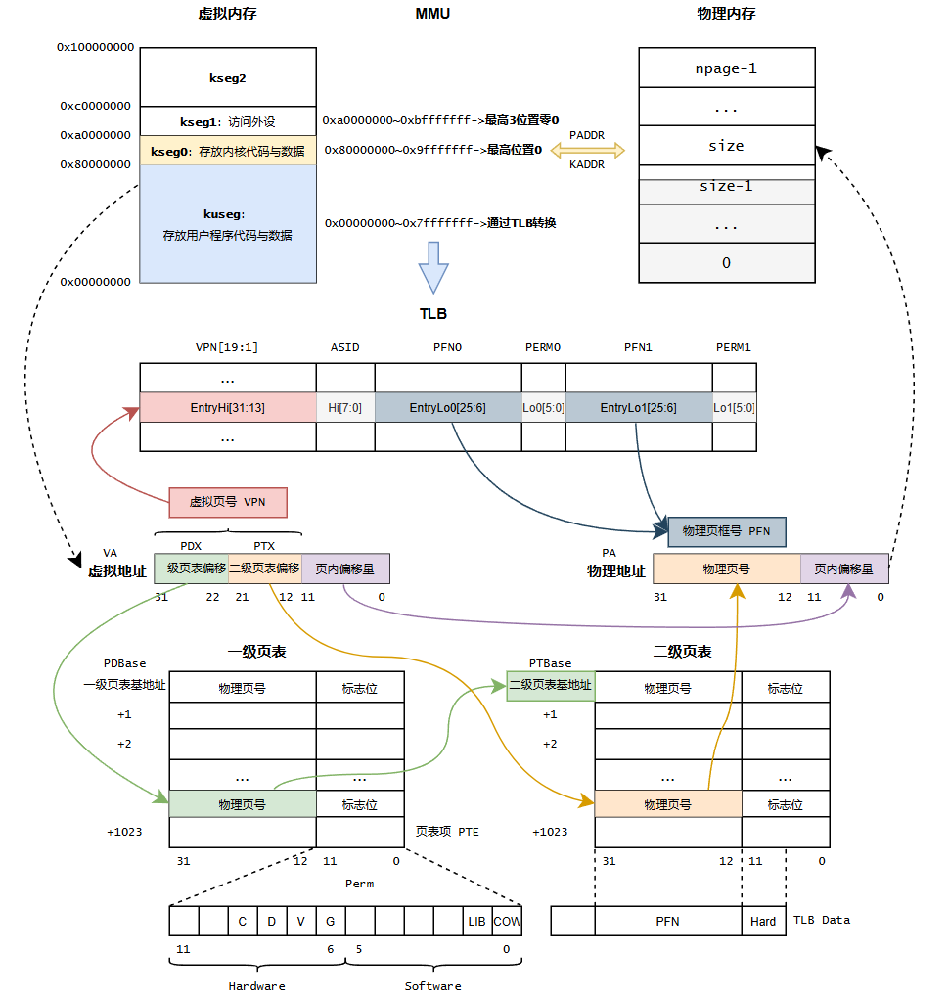

# Memory

程序中的变量都存在于虚拟地址空间

## 访存流程总览

虚拟地址会先被**MMU硬件(即TLB)**映射到物理地址，随后使用物理地址来访问内存或其他外设




## 内核初始化 (续)

Lab2中会在 `mips_init` 中调用三个函数，分别完成探测内存、初始化虚拟地址和初始化页的工作。均在 `kern/pmap.c` 中实现

```c
void mips_init(u_int argc, char **argv, char **penv, u_int ram_low_size) {
	printk("init.c:\tmips_init() is called\n");
	
    mips_detect_memory(ram_low_size);
	mips_vm_init();
	page_init();
}
```

`ram_low_size` 是在启动时bootloader传递给内核的参数，代表可用的物理内存大小 (以字节为单位)

### 探测内存

`mips_detect_memory` 获取总物理内存的大小，并计算物理页数

```c
void mips_detect_memory(u_int _memsize) {
	memsize = _memsize;		// memsize是全局变量
	npage = memsize / PAGE_SIZE;	// 在mmu.h中定义的宏
	printk("Memory size: %lu KiB, number of pages: %lu\n", memsize / 1024, npage);
}
```

`PAGE_SIZE` 定义在 mmu.h 中，为 4KB

```c
#define PAGE_SIZE 4096
```

### 分配内存空间

在建立页式内存管理机制之前，我们都是在kseg0内访问内存，此区域使用 `alloc` 函数分配内存空间

```c
void *alloc(u_int n, u_int align, int clear) {
	extern char end[];
	u_long alloced_mem;		// 已分配的物理内存空间的首地址
	if (freemem == 0) {
		freemem = (u_long)end;
	}
```

`end` 定义在 kernel.lds 中，

```c
. = 0x80400000;
end = . ;
```

0x80400000 映射到物理地址 0x400000，在0x400000之前存放着操作系统内核的代码，用0x400000后的空间建立管理内存的数据结构

`freemem` 是存放可用虚拟内存的全局变量 (小于其对应的物理地址的物理内存已经被分配了)。接着，把 `freemem` 以 `align` 对齐

```c
freemem = ROUND(freemem, align);
```

`ROUND` 宏定义在 include/types.h 中，主要原理是将低位抹零。还有一个对应的宏 `ROUNDDOWN` 。前者向上对齐，后者向下对齐。

```c
/* Rounding; only works for n = power of two */
#define ROUND(a, n) (((((u_long)(a)) + (n)-1)) & ~((n)-1))
#define ROUNDDOWN(a, n) (((u_long)(a)) & ~((n)-1))
```

分配 `n` 个字节内存

```c
    alloced_mem = freemem;
    freemem = freemem + n;
    panic_on(PADDR(freemem) >= memsize);
```

`panic_on` 类似 `assert` ，`PADDR` 宏定义在 include/mmu.h，返回kseg0中虚拟地址所对应物理地址，超出物理地址则报错。

```c
#define PADDR(kva) \
	({ \
		u_long _a = (u_long)(kva); \
		if (_a < ULIM) \
			panic("PADDR called with invalid kva %08lx", _a); \
		_a - ULIM; \
	})
```

`ULIM` 是 kseg0 的基地址，因此 `_a-ULIM` 就等价于最高三位抹零。`PADDR` 还有一个对应宏 `KADDR`，将物理地址转换为 kseg0 中的内核虚拟地址，只不过是将减号改为加号。

最后，由 `clear` 表示是否需要清零，如果需要，则使用 `memset` 函数清零。接着返回 `alloced_mem` 的地址。

```c
    if (clear) {
        memset((void *)alloced_mem, 0, n);
    }
    return (void *)alloced_mem;
}
```

### 初始化虚拟地址

我们考虑 `mips_vm_init` 函数。

```c
void mips_vm_init() {
	pages = (struct Page *)alloc(npage * sizeof(struct Page), PAGE_SIZE, 1);
	printk("to memory %x for struct Pages.\n", freemem);
	printk("pmap.c:\t mips vm init success\n");
}
```

函数会申请一部分空间用作页控制块。页控制块是 `struct Page` 类型的结构体。每一个页控制块对应一个物理页。展开后的 `struct Page` 为:

```c
struct Page {
	struct {
		struct Page *le_next;
		struct Page **le_prev;
	} pp_link;
	u_short pp_ref;		// 物理内存被引用的次数,即有多少虚拟页映射到该物理页
};
```

其有一个用于表示链表前后节点的结构体 `pp_link`；以及用于引用计数，反映页的使用情况的 `pp_ref`。在 `pmap.h` 中，我们知道，所有的页控制块保存在一个数组中，也是我们在 `mips_vm_init` 中申请的空间

```c
extern struct Page *pages;
```

物理页是连续排列的，通过指针减法 (算的是索引)，可以得到页控制块对应的是第几个页:

```c
static inline u_long page2ppn(struct Page *pp) {
	return pp - pages;
}
```

物理页号乘以物理页大小即可得对应的物理页基地址:

```c
// mmu.h
#define PGSHIFT 12

// pmap.h
static inline u_long page2pa(struct Page *pp) {
	return page2ppn(pp) << PGSHIFT;
}
```

反过来，我们可以由物理地址获取对应的页控制块

```c
// mmu.h
#define PPN(pa) (((u_long)(pa)) >> PGSHIFT)

// pmap.h
static inline struct Page *pa2page(u_long pa) {
	if (PPN(pa) >= npage) {
		panic("pa2page called with invalid pa: %x", pa);
	}
	return &pages[PPN(pa)];
}
```

所以到目前，我们创建了 `struct Page` 数组，大小为 `npage`

### 双向链表宏

在 include/queue.h 中封装了链表宏，通过使用宏，在C中实现了泛型。`LIST_HEAD` 表示链表头或链表本身的类型，`LIST_ENTRY` 表示链表中元素的类型

```c
#define LIST_HEAD(name, type)   \
	struct name { 				\
		struct type *lh_first;	\
	}

#define LIST_ENTRY(type) 	\
	struct { 				\
		struct type *le_next;  /* next element */ 					  \
		struct type **le_prev; /* address of previous next element */ \
	}
```

`LIST_ENTRY` 本质是一个链表项，`le_prev` 指向前一个元素链表项的 `le_next` ( `struct Page *` 的指针，所以是 `**` )

```c
// pmap.h
LIST_HEAD(Page_list, Page);
typedef LIST_ENTRY(Page) Page_LIST_entry_t;

struct Page {
	Page_LIST_entry_t pp_link;
	u_short pp_ref;
};
```

等价于:

```c
struct Page_list {
	struct Page *lh_first;
}

typedef struct {
	struct Page *le_next;
	struct Page **le_prev;
} Page_LIST_entry_t;
```

其他宏:

```c
#define LIST_EMPTY(head) ((head) -> lh_first == NULL)
#define LIST_FIRST(head) ((head) -> lh_first)
#define LIST_NEXT(elm, field) ((elm)->field.le_next)	// elm 是struct Page *型，返回也是struct Page *型
#define LIST_INIT(head) \
	do { \
		LIST_FIRST((head)) = NULL; \
	} while (0)
#define LIST_FOREACH(var, head, field) \
	for ((var) = LIST_FIRST((head)); (var); (var) = LIST_NEXT((var), field))
#define LIST_INSERT_HEAD(head, elm, field) \
	do { \
		if ((LIST_NEXT((elm), field) = LIST_FIRST((head))) != NULL) \
			LIST_FIRST((head))->field.le_prev = &LIST_NEXT((elm), field); \
		LIST_FIRST((head)) = (elm); \
		(elm)->field.le_prev = &LIST_FIRST((head)); \
	} while (0)

struct Page_list page_free_list;
struct Page *pp = LIST_FIRST(&page_free_list);
```


Exercise中的 `LIST_INSERT_AFTER` 将 `elm` 插在已有元素 `listelm` 之后:

```c
#define LIST_INSERT_AFTER(listelm, elm, field)	\
	do {	\
		if ((LIST_NEXT((elm), field) = LIST_NEXT((listelm), field)) != NULL)	\
			LIST_NEXT((listelm), field)->field.le_prev = &LIST_NEXT((elm), field);	\
		LIST_NEXT((listelm), field) = (elm);	\
		(elm)->field.le_prev = &LIST_NEXT((listelm), field);	\
	} while (0)
```

主要改变 `elm` 的 `le_next` / `le_prev` ，`listelm` 的 `le_next` 和其后元素的 `le_prev`

### 初始化页

读懂了链表宏，现在可以来看 `page_init` 了。在 `page_init` 中，我们将对 `mips_vm_init` 申请的数组进行初始化，并维护一个存储所有空闲页的链表。

> 我们有物理内存，并将其划分成了许多的页，这些页的信息通过页控制块保存在 `pages` 数组中。可是现在页控制块还没有被设置，具体来说，我们还没有明确哪些页是可用的，哪些页是已经被使用的。因此接下来我们要做到就是将页划分成可用和不可用的，并将可用的页控制块放入 `page_free_list` 中（这样想要申请新的页，只需要取出该链表的头结点即可）。

第一步，初始化 `page_free_list` ，实际上只是将其 `lh_first` 指针置位 NULL

```c
void page_init(void) {
	LIST_INIT(&page_free_list);
```

然后确定已使用的最大地址，为了适配页的大小，需要进行对齐

```c
	freemem = ROUND(freemem, PAGE_SIZE);	// 4KB,mmu.h中定义
```

接着把已使用过的页的引用数设置为 `1` ，表示页已被使用

```c
	u_long usedpage = PPN(PADDR(freemem));
	for (u_long i = 0; i < usedpage; i++) {	// 注意用u_long
		pages[i].pp_ref = 1;
	}
```

最后把剩下的页控制块的 `pp_ref` 置 `0` ，表示还没被使用过，并将页控制块插入到 `page_free_list` 中

```c
	for (u_long i = usedpage; i < npage; i++) {
		pages[i].pp_ref = 0;
		LIST_INSERT_HEAD(&page_free_list, pages + i, pp_link);
	}
}
```

后续将不再使用 `alloc` 函数了，“分配空间”操作将由 `page_alloc()` 函数完成，见TLB部分⬇️

## 页式内存管理

### 两级页表结构

32位虚拟地址通常用 31-22 位表示一级页表项的偏移量，21-12 位表示二级页表项的偏移量，11-0 位表示页内偏移量。我们把一级页表称为页目录 (Page Directory)，二级页表称为页表 (Page Table)。`PDX(va)` 宏可以获取虚拟地址 `va` 的 31-22 位，`PTX(va)` 可以获取虚拟地址 `va` 的 21-12 位。

获取物理地址的流程如下


### 页表项

每个页表均由 1024 个页表项组成，每个页表项由 32 位组成，包括 20 位物理页号以及 12 位标志位。其中，12 位标志位包含高 6 位硬件标志位与低 6 位软件标志位。高 6 位硬件标志位存入 EntryLo 寄存器中，供硬件使用 (例如标志位 PTE_V、PTE_D 就分别对应 EntryLo 中的 V、D 标志位)。低 6 位软件标志位不会被存入 TLB 中，供软件使用

`Pde` 表示一级页表项类型，`Pte` 表示二级页表项类型，本质都是 u_long

```c
typedef u_long Pde;
typedef u_long Pte;
```

页表项的 12 位标志位:

- `PTE_V`: 有效位，若某页表项的有效位为 1，则该页表项有效，其中高 20 位就是对应的物理页号
- `PTE_D`: 可写位，若某页表项的可写位为 1，则允许经由该页表项对物理页进行写操作
- `PTE_G`: 全局位，若某页表项的全局位为 1，则 TLB 仅通过虚页号匹配表项，而不匹配ASID
- `PTE_C_CACHEABLE`: 可缓存位，配置对应页面的访问属性为可缓存。通常会将物理页面配置为可缓存，以允许 CPU 使用 cache 加速对这些页面的访存请求
- `PTE_COW`: 写时复制位
- `PTE_LIBRARY`: 共享页面位，用于实现管道机制


## TLB概览

当我们使用 kuseg 地址空间的虚拟地址访问内存时，我们会通过 TLB 将其转换为物理地址。当 TLB 中查询不到对应的物理地址时，就会发生 TLB Miss 异常。这时将跳转到异常处理函数，执行 TLB 重填。在 Lab2，我们的代码还未启用异常处理，因此无法真正运行页式内存管理机制。

### TLB的结构

TLB本质上构建了一个映射: < VPN, ASID > $\rightarrow$ < PFN, N, D, V, G >。每个TLB表项包含两个部分，一组Key和两组Data。TLB采用奇偶页，使用VPN中的高 19 位与ASID作为Key，一次查找两个Data (一对相邻页面的两个页表项)，并用VPN中的最低位在两个Data中选择命中的结果。EntryHi, EntryLo0, EntryLo1是CP0中的寄存器。EntryLo0存储Key对应的偶页，EntryLo1存储Key对应的奇页。


Key (EntryHi):

- VPN: 当TLB Miss时，EntryHi中的VPN自动由硬件填充为va的虚页号；此外，填充与检索时软件负责填充VPN
- ASID (Address Space Identifier) 用于区分不同进程的地址空间

Data (EntryLo):

- 软件通过填写PFN，接着使用TLB写指令，才可将此时EntryHi中的Key与EntryLo中的Data写入TLB
- C, D, V, G和PTE的含义差不多

### 相关指令

`tlbr` 以 Index 寄存器中的值为索引，读出 TLB 中对应的表项到 EntryHi, EntryLo0, EntryLo1

`tlbwi` 以 Index 寄存器中的值为索引，将此时 EntryHi, EntryLo0, EntryLo1 的值写到索引指定的 TLB 表项中

`tlbwr` 将 EntryHi, EntryLo0, EntryLo1 的数据随机写到一个 TLB 表项中(此处使用 Random 寄存器来“随机”指定表项，Random 寄存器本质上是一个不停运行的循环计数器)

`tlbp` 根据 EntryHi 中的 Key，查找 TLB 中与之对应的表项，并将表项的索引存入 Index 寄存器(若未找到匹配项，则 Index 最高位被置 1)


### TLB访存流程

本实验所使用的 MIPS 4Kc 的 MMU 硬件中只有 TLB，在用户地址空间访存时，虚拟地址到物理地址的转换**均通过 TLB 进行**。访问需要经过转换的虚拟内存地址时，首先要使用虚拟页号和当前进程的 ASID 在 TLB 中查询该地址对应的物理页号，如果虚页号和 ASID 组成的 Key 在 TLB 中存在对应的 TLB 表项(或虚页号在 TLB 中存在对应的 TLB 表项且表项权限位中的 G 位为 1)时，则可取得物理地址；如果不能查询到，则产生 TLB Miss 异常，系统跳转到异常处理程序，在内核的两级页表结构中找到对应的物理地址，对 TLB 进行重填。

操作系统可以修改页表中虚拟地址映射的物理页号或映射的权限位。

在更新页表中虚拟地址对应的页表项时，将TLB对应的旧表项无效化。这样在下一次访问该虚拟地址时，硬件会触发TLB Miss，此时操作系统对TLB进行重填。

## TLB

### TLB重填

TLB 的重填过程由 kern/tlb_asm.S 中的 `do_tlb_refill` 函数完成。该函数是汇编实现的。

首先我们使用 `NESTED` 定义函数标签。`NESTED` 与 `LEAF` 宏相对应。前者表示非叶函数，后者表示叶函数。

```assembly
NESTED(do_tlb_refill, 24, zero)
```

我们希望汇编代码尽可能少，`do_tlb_refill` 只做必要的处理，随后调用 c 函数，即 `_do_tlb_refill` 进行下一步的处理。

因此首先我们设置参数。第二个参数 (a1) 是 `BadVAddr` 寄存器的值，即发生 TLB Miss 的虚拟地址；第三个参数 (a2) 是 `EntryHi` 寄存器的低8位，即当前进程的 ASID。第一个参数 (a0) 存的是 sp+12 的值。

```assembly
	mfc0    a1, CP0_BADVADDR
	mfc0    a2, CP0_ENTRYHI
	andi    a2, a2, 0xff
.globl do_tlb_refill_call;
do_tlb_refill_call:
	addi    sp, sp, -24
	sw      ra, 20(sp)		# sp+20存放ra
	addi    a0, sp, 12
```

接着我们调用 c 函数 `_do_tlb_refill`，函数的结构如下，

```c
void _do_tlb_refill(u_long *pentrylo, u_int va, u_int asid);
```

会找到虚拟地址对应的页表项并写入 `pentrylo[0]` 和 `pentrylo[1]` 。通过sp指针加法，我们就能获取写入的内容。

```assembly
	jal     _do_tlb_refill
	lw      a0, 12(sp)	# Even page table entry
	lw      a1, 16(sp)	# Odd page table entry
	lw      ra, 20(sp)
	addi    sp, sp, 24	# Deallocate stack
```

我们将该值存入 `EntryLo`，并将 `EntryHi` 和 `EntryLo` 的值写入 TLB。`tlbwr` 表示随机写入TLB中的一个表项

```assembly
	mtc0    a0, CP0_ENTRYLO0	# Even page table entry
	mtc0    a1, CP0_ENTRYLO1	# Odd page table entry
	nop
	tlbwr
	jr      ra
END(do_tlb_refill)
```

这样就完成了TLB重填。跳回到正常程序后，此前产生异常的虚拟地址就可以通过 TLB 访问内存了。

接着我们仔细看看 `_do_tlb_refill` 函数，其定义在 kern/tlbex.c 中。我们会不断查找虚拟地址对应的页表项，如果未找到，则试图申请一个新的页表项。把申请到的页表项内容写入给定地址。

```c
void _do_tlb_refill(u_long *pentrylo, u_int va, u_int asid) {
	tlb_invalidate(asid, va);	//
	Pte *ppte;
    
	while (page_lookup(cur_pgdir, va, &ppte) == NULL) {		//
		passive_alloc(va, cur_pgdir, asid);		//
	}

	ppte = (Pte *)((u_long)ppte & ~0x7);
	pentrylo[0] = ppte[0] >> 6;
	pentrylo[1] = ppte[1] >> 6;
}
```

值得注意的是，`_do_tlb_refill` 调用 `page_lookup` 函数时页目录基地址参数使用的是全局变量 `cur_pgdir`。可是这个全局变量并没有被赋值。这也是在 Lab2 中页式内存管理无法使用的一个原因。

### 页的查找

接着我们详细讨论 `_do_tlb_refill` 中所使用的函数。

`page_lookup` 函数用于查找虚拟地址 va 对应的页控制块，同时将 ppte 指向的空间设为对应的二级页表项地址。

其首先调用了另一个函数 `pgdir_walk`。这个函数可以获取想要转换的虚拟地址对应的（二级）页表项地址，通过 `pte` 返回。其中第三个参数 `create` 表示若未找到对应页表是否创建新的页表，此处为 0 表示不创建。

```c
struct Page *page_lookup(Pde *pgdir, u_long va, Pte **ppte) {
	struct Page *pp;
	Pte *pte;
	pgdir_walk(pgdir, va, 0, &pte);
```

接着 `page_lookup` 检查是否获取到对应的页表项，未获取到返回 `NULL`。

```c
	if (pte == NULL || (*pte & PTE_V) == 0) {
		return NULL;
	}
```

`PTE_V` 宏是有效位的掩码，借助它可以查看有效位的状态。

```c
#define PTE_V (0x0002 << PTE_HARDFLAG_SHIFT)
```

如果获取到，我们找到页表项对应的页控制块，并返回。

```c
	pp = pa2page(*pte);
	if (ppte) {
		*ppte = pte;
	}
	return pp;
}
```

接着我们考察 `pgdir_walk` 函数，这个函数也在 kern/pmap.c 中定义。如前所述，这个函数要实现查找虚拟地址对应的（二级）页表项，并根据 `create` 参数的设置在未找到二级页表时创建二级页表。


首先，我们根据虚拟地址确定对应的页目录项的地址。

```c
static int pgdir_walk(Pde *pgdir, u_long va, int create, Pte **ppte) {
	Pde *pgdir_entryp;
	struct Page *pp;
	pgdir_entryp = pgdir + PDX(va);
```

`PDX` 宏用于获取虚拟地址的 22-31 位，这是虚拟地址对应的页目录项相对于页目录基地址的偏移。

随后我们判断该页目录项是否有效。如果无效，判断是否需要创建新的二级页表。如需要则使用 `page_alloc` 函数申请一个物理页，并设置虚拟地址对应页目录项的内容 `*pgdir_entryp = page2pa(pp) | PTE_C_CACHEABLE | PTE_V`，使其与该物理页关联。

```c
	if (!(*pgdir_entryp & PTE_V )) {
		if (create) {
			if (page_alloc(&pp) != 0) {
				return -E_NO_MEM;
			}
			pp -> pp_ref++;
			*pgdir_entryp = page2pa(pp) | PTE_C_CACHEABLE | PTE_V;
            *ppte = page2kva(pp);
```

`page_alloc` 是一个简单的函数，用于从 `page_free_list` 中抽取第一个空闲的页控制块，将页控制块对应的物理内存作为分配的内存。将该内存初始化为 0。唯一需要注意的是 `page2kva`，此函数实际上是 `KADDR(page2pa(pp))`。

```c
int page_alloc(struct Page **new) {
	struct Page *pp;
	if (LIST_EMPTY(&page_free_list)) {
		return -E_NO_MEM;	// 定义在error.h
	}
	pp = LIST_FIRST(&page_free_list);
	LIST_REMOVE(pp, pp_link);
	memset((void *)page2kva(pp), 0, PAGE_SIZE);
	*new = pp;
	return 0;
}
```

回到 `pgdir_walk`，如果不需要创建，则直接返回。

```c
		} else {
			*ppte = NULL;
			return 0;
		}
```

另一个分支表示页目录有效，二级页表必然存在。我们获取二级页表的虚拟基地址，并找到虚拟地址 `va` 对应的二级页表项，返回。

```c
	} else {
		*ppte = (Pte *) KADDR(PTE_ADDR(*pgdir_entryp));
	}
```

宏 `PTE_ADDR` 定义在 include/mmu.h 中。它返回页目录项对应的二级页表的基地址。实际上就是将页目录项内容的低 12 位抹零。

```c
#define PTE_ADDR(pte) (((u_long)(pte)) & ~0xFFF)
```

### 页的申请

现在我们来分析 `_do_tlb_refill` 中的 `passive_alloc`

```c
	while (page_lookup(cur_pgdir, va, &ppte) == NULL) {
		passive_alloc(va, cur_pgdir, asid);
	}
```

`passive_alloc` 定义在 kern/tlbex.c 中。这是一个用于为虚拟地址申请物理页的函数。它的参数是: 想要关联物理地址的虚拟地址、页目录的基地址和标识进程的 asid。

```c
static void passive_alloc(u_int va, Pde *pgdir, u_int asid) {
```

函数开头就是一些检查地址是否非法的判断语句。接下来的内容是，函数通过 `page_alloc` 申请一个物理页，并试图通过 `page_insert` 建立物理页和虚拟地址的联系。

```c
	panic_on(page_alloc(&p));
	panic_on(page_insert(
        pgdir, asid, p, PTE_ADDR(va), (va >= UVPT && va < ULIM) ? 0 : PTE_D
    ));
```

现在介绍 `page_insert`。函数首先调用 `pgdir_walk`，试图获取当前虚拟地址对应的二级页表项。

```c
int page_insert(Pde *pgdir, u_int asid, struct Page *pp, u_long va, u_int perm) {
	Pte *pte;
	pgdir_walk(pgdir, va, 0, &pte);
```

如果确实获得了虚拟地址对应的二级页表项，并且是有效的，那么判断该页表项对应的物理页是否就是 `va` 想要映射的物理页（通过比较页控制块）。如果不一样，那么调用 `page_remove` 移除虚拟地址到原有的页的映射。`page_remove` 将在后续说明。

```c
	if (pte && (*pte & PTE_V)) {
		if (pa2page(*pte) != pp) {
			page_remove(pgdir, asid, va);
```

如果相同，说明虚拟地址已经映射到了对应的物理页。这时我们只需要更新一下页表项的权限。为了保证对页表的修改都能反映到 TLB 中，我们要调用 `tlb_invalidate` 函数将原有的关于 `va` 和 `asid` 的 TLB 表项清除。`tlb_invalidate` 将在后面说明。

```c
		} else {
			tlb_invalidate(asid, va);
			*pte = page2pa(pp) | perm | PTE_C_CACHEABLE | PTE_V;
			return 0;
		}
	}
```

程序执行 `page_insert` 的后续语句时，一定不存在虚拟地址 `va` 到页控制块对应的物理页的映射。于是接下来，我们就要建立这样的映射。首先我们还是要调用 `tlb_invalidate` 清除原有内容。

```c
	tlb_invalidate(asid, va);
```

随后再调用一次 `pgdir_walk`，只不过这次 `create=1`。这将获得 `va` 对应的二级页表项

```c
	if (pgdir_walk(pgdir, va, 1, &pte) != 0) {
		return -E_NO_MEM;
	}
```

最后，我们只需要建立二级页表项到物理页的联系即可。我们只需修改二级页表项的内容，修改为物理页的物理地址和权限设置即可。同时不要忘记递增页控制块的引用计数。

```c
	(pp -> pp_ref)++;
	*pte = page2pa(pp) | perm | PTE_C_CACHEABLE | PTE_V;
	return 0;
}
```

### 页的移除

让我们重新拾起按下不表的 `page_remove` 和 `tlb_invalidate`。我们首先考察 `page_remove`，此函数定义在 kern/pmap.c 中。用于取消虚拟地址 `va` 到物理页的映射。

首先该函数调用 `page_lookup` 查找与 `va` 和 `asid` 映射的物理页。如果不存在这样的页，则直接返回

```c
void page_remove(Pde *pgdir, u_int asid, u_long va) {
	Pte *pte;
	struct Page *pp = page_lookup(pgdir, va, &pte);
	if (pp == NULL) {
		return;
	}
```

如果存在，则调用 `page_decref` 以递减该页的引用数。当引用数等于零时，将该物理页重新放入未使用页的链表。因为对页表进行了修改，需要调用 `tlb_invalidate` 确保 TLB 中不保留原有内容。

```c
	page_decref(pp);
	*pte = 0;
	tlb_invalidate(asid, va);
	return;
}
```

`page_decref` 定义如下，该函数和 `page_free` 都定义在 kern/pmap.c 中。

```c
void page_decref(struct Page *pp) {
	assert(pp->pp_ref > 0);
	if (--pp->pp_ref == 0) {
		page_free(pp);
	}
}

void page_free(struct Page *pp) {
	assert(pp->pp_ref == 0);
	LIST_INSERT_HEAD(&page_free_list, pp, pp_link);
}
```

kern/tlbex.c 中的 `tlb_invalidate` 函数可以删除虚拟地址在 TLB 中的旧表项。

```c
void tlb_invalidate(u_int asid, u_long va) {
	tlb_out((va & ~GENMASK(PGSHIFT, 0)) | (asid & (NASID - 1)));
}
```

`tlb_out` 定义在 kern/tlb_asm.S 中。首先可知，`tlb_out` 是一个叶函数。

```assembly
LEAF(tlb_out)
```

函数在一开始将原有的 `EnryHi` 寄存器中的值保存，并将传入的参数 `a0` 设为 `EnryHi` 新的值。然后根据新的值查找 TLB 表项。

```assembly
.set noreorder	# 关闭指令重排
	mfc0    t0, CP0_ENTRYHI
	mtc0    a0, CP0_ENTRYHI
	nop
	tlbp	# probe TLB entry, 将表项的索引存入Index
	nop
```

随后将 `Index` 寄存器中的查询结果存储到 `t1` 寄存器，如果结果小于 0，说明未找到对应的表项，跳转到 NO_SUCH_ENTRY，不需要进行清零操作。

```assembly
	mfc0    t1, CP0_INDEX	# TLB查询结果
.set reorder
	bltz    t1, NO_SUCH_ENTRY	# 小于0表示没有此表项
```

这里分别将 `EntryHi` 和 `EntryLo` 设置为 0。并将内容写入对应的表项，实现清零。

```assembly
.set noreorder
	mtc0    zero, CP0_ENTRYHI
	mtc0    zero, CP0_ENTRYLO0
	mtc0    zero, CP0_ENTRYLO1
	nop
	tlbwi	# write CP0 EntryHi/Lo into TLB at CP0 Index
```

最后，恢复进入函数时 `EntryHi` 存储的值，函数返回。

```assembly
.set reorder
NO_SUCH_ENTRY:
	mtc0    t0, CP0_ENTRYHI
	j       ra
END(tlb_out)
```

## Reference

- [zzq同学绘制的访存结构图](https://os.buaa.edu.cn/discussion/408)
- [Wokron｜BUAA-OS 实验笔记之 Lab2](https://wokron.github.io/posts/buaa-os-lab2/)
