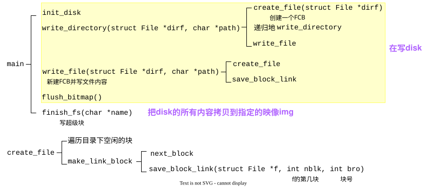
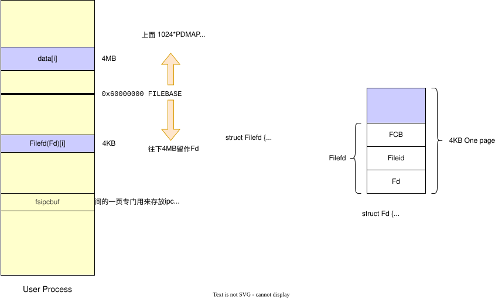
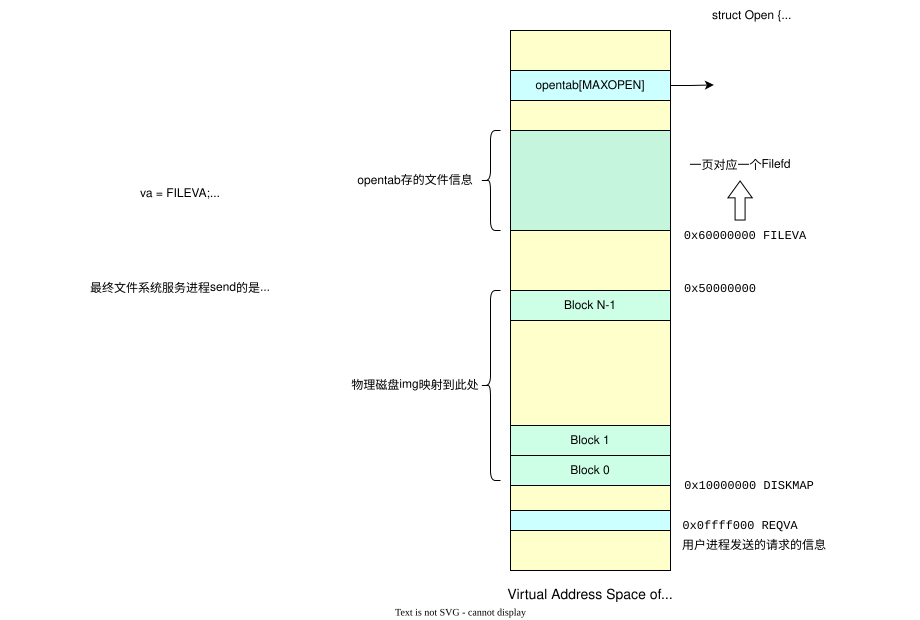

# File System

> Fork from [wokron's blog](https://wokron.github.io/posts/buaa-os-lab5/) （写得真好呀）
>
> 这篇文章太长了，以至于在本地Typora都有懒加载的感觉👾 serv.c 里的函数调用看得我是眼花缭乱，也不是很懂，有时间一定再认真读读代码🕵️‍♀️

Lab5 需要实现一个文件系统，主要分为四部分，分别是镜像制作工具、文件系统服务进程、文件操作库函数和关于设备的系统调用。代码集中在 fs 文件夹、tools/fsformat.c、user/lib 中。

## 磁盘镜像

tools 文件夹下的 fsformat 是磁盘镜像制作工具，可以将多个文件按照内核所定义的文件系统写入到磁盘镜像中。需要注意，tools/fsformat.c 编译生成的 fsformat 运行于 Linux 宿主机上，不属于MOS内核。

```bash
tools
├── fsformat.c
├── ...
```

总览:



[fsformat.c](https://www.chasetsai.cc/Dev/Operating%20System/lab5_codes/fsformat.c)

### 磁盘数据初始化

查看 tools/fsformat.c 文件。其 `main` 函数首先调用了 `init_disk` 初始化磁盘

```c
int main(int argc, char **argv) {
	static_assert(sizeof(struct File) == FILE_STRUCT_SIZE);
	init_disk();
```

查看 `init_disk()` 函数:

```c
void init_disk() {
	int i, diff;
	disk[0].type = BLOCK_BOOT;
```

该函数中用到了 `disk` :

```c
// user/include/fs.h
#define BLOCK_SIZE PAGE_SIZE	// 也就是4096字节

// tools/fsformat.c
#define NBLOCK 1024
struct Block {
	uint8_t data[BLOCK_SIZE];
	uint32_t type;
} disk[NBLOCK];
```

struct BLOCK 有字段 `data`，是一个 `BLOCK_SIZE` 字节大小的空间，用于存储一个磁盘块的数据。`NBLOCK` $\times$ `BLOCK_SIZE` $=$ 磁盘空间大小。`disk` 的作用是在构筑磁盘镜像时暂时存储磁盘数据，等到构筑完成后再将 `disk` 中 `data` 的内容拼接并输出为二进制镜像文件。

> 磁盘块是对磁盘空间的逻辑划分；扇区是对磁盘空间的物理划分

另外 `Block` 结构体还有一个字段 `type`，该字段的值为如下枚举的值

```c
enum {
	BLOCK_FREE = 0,
	BLOCK_BOOT = 1,
	BLOCK_BMAP = 2,
	BLOCK_SUPER = 3,
	BLOCK_DATA = 4,
	BLOCK_FILE = 5,
	BLOCK_INDEX = 6,
};
```

让我们回到 `init_disk`。该函数首先将第一个磁盘块类型设为 `BLOCK_BOOT`，表示主引导扇区。之后我们要从第三个磁盘块开始（为什么不是第二个？因为第二个磁盘块为 “超级块”，见后文），设置磁盘块的位图分配机制。

```c
// #define BLOCK_SIZE_BIT (BLOCK_SIZE * 8)
	nbitblock = (NBLOCK + BLOCK_SIZE_BIT - 1) / BLOCK_SIZE_BIT;
	nextbno = 2 + nbitblock;	// 全局变量
```

计算在磁盘中存储**位图**需要的磁盘块数量。`NBLOCK` 是磁盘块的总数，那么我们同样需要 `NBLOCK` bit 大小的位图，又因为一个磁盘块有 `BLOCK_SIZE_BIT` bit，那么总共需要 `NBLOCK / BLOCK_SIZE_BIT` 个磁盘块。向上取整，总共需要 `nbitblock` 个磁盘块来存储位图，那么下一个空闲的磁盘块就是 `nextbno = 2 + nbitblock` 

对于存储位图的磁盘块，我们将其初始化。首先我们将这些磁盘块标记为 `BLOCK_BMAP`，表示他们用作存储位图。

```c
	for (i = 0; i < nbitblock; ++i) {
		disk[2 + i].type = BLOCK_BMAP;
	}
```

对于位图，我们设定 `1` 表示空闲，`0` 表示使用。因此我们先将所有的磁盘块数据都设定为 `1`

```c
	for (i = 0; i < nbitblock; ++i) {
		memset(disk[2 + i].data, 0xff, BLOCK_SIZE);
	}
```

最后如果位图没有占满整个磁盘块，那么还需要将最后一个磁盘块末位不作为位图使用的部分置 `0` ，表示不可用

```c
	if (NBLOCK != nbitblock * BLOCK_SIZE_BIT) {
		diff = NBLOCK % BLOCK_SIZE_BIT / 8;
		memset(disk[2 + (nbitblock - 1)].data + diff, 0x00, BLOCK_SIZE - diff);
	}
```

### 文件控制块

不要忘了第二个磁盘块，这个磁盘块会用作“超级块” (super block)。所谓超级块，就是文件系统的起点，该磁盘块中存储了**根目录文件**的信息。超级块定义在 user/include/fs.h 中，包含了用于验证文件系统的魔数 `s_magic`，磁盘块总数 `s_nblocks` 和根目录文件节点 `s_root`

```c
#define FS_MAGIC 0x68286097 // Everyone's favorite OS class
struct Super {
	uint32_t s_magic;   // Magic number: FS_MAGIC
	uint32_t s_nblocks; // Total number of blocks on disk
	struct File s_root; // Root directory node
};
```

在MOS的文件系统中，文件信息通过 `struct File` 结构体 (即文件控制块FCB) 存储。

```c
// user/include/fs.h
#define FILE_STRUCT_SIZE 256
struct File {
	char f_name[MAXNAMELEN]; 
	uint32_t f_size;	 // file size in bytes
	uint32_t f_type;
	uint32_t f_direct[NDIRECT];
	uint32_t f_indirect;

    // the pointer to the dir where this file is in, valid only in memory
	struct File *f_dir; 
	char f_pad[FILE_STRUCT_SIZE - MAXNAMELEN - (3 + NDIRECT) * 4 - sizeof(void *)];
    // 在32位系统中，sizeof(void *)占4个字节
} __attribute__((aligned(4), packed));
```

该结构体中包含了用于存储指向存储文件内容的磁盘块的编号的数组 `f_direct`，以及指向存储“存储指向存储文件内容的磁盘块的编号的数组”的磁盘块的编号 `f_indirect`，还有自己所在的目录 `f_dir`。最后 `f_pad` 将文件控制块的大小填充到 `FILE_STRUCT_SIZE`，保证多个文件控制块能够填满整个磁盘。

> 文件的内容需要在磁盘中存储，这些内容分布于不同的磁盘块中，因此还需要对这些内容进行管理，也就是要再分配一个磁盘块用于存储**文件控制块**，该结构体中要存储那些存储文件内容的磁盘块的地址。
>
> `f_direct` 中就存储了前 `NDIRECT` 个磁盘块的编号方便快速访问。但如果文件较大，超出了 `NDIRECT` 个磁盘块的大小的话要怎么办？这就要再分配一个磁盘块，用这个磁盘块的全部空间作为存储磁盘块编号的数组，保存那些存储了文件内容的磁盘块的编号。再使用 `f_indirect` 保存这个新分配的，作为数组的磁盘块的编号。如图所示:
>
> 

在 `init_disk` 的最后，就设置了超级块的信息:

```c
	disk[1].type = BLOCK_SUPER;
	super.s_magic = FS_MAGIC;
	super.s_nblocks = NBLOCK;
	super.s_root.f_type = FTYPE_DIR;
	strcpy(super.s_root.f_name, "/");
}
```

其中设置了根目录文件类型 `s_root.f_type` 为 `FTYPE_DIR`，表示该文件为目录

```c
// user/include/fs.h
#define FTYPE_REG 0 // Regular file
#define FTYPE_DIR 1 // Directory
```

最后我们设置根目录的名字为 `/` ，该文件系统的路径是 Linux 的格式。

### 文件写入

fsformat 工具的调用方式为: 在宿主Linux环境下执行命令 `fsformat <镜像文件名> [要包含的文件或目录...]` ，其生成的镜像文件便可被 QEMU 作为硬盘挂载使用。

生成适应MOS的镜像的方式为，在 `main` 函数的后部分，不断读取命令行参数，通过 `stat` 函数（这是库函数）判断文件类型，分别调用 `write_directory` 和 `write_file` 将文件内容写入磁盘镜像中。需要注意这里传入了 `&super.s_root`，也就是根目录文件作为参数。

```c
	if (argc < 3) {
		fprintf(stderr, "Usage: fsformat  [files or directories]...\n");
		exit(1);
	}

	for (int i = 2; i < argc; i++) {
		char *name = argv[i];
		struct stat stat_buf;
		int r = stat(name, &stat_buf);
		assert(r == 0);
		if (S_ISDIR(stat_buf.st_mode)) {
			printf("writing directory '%s' recursively into disk\n", name);
			write_directory(&super.s_root, name);
		} else if (S_ISREG(stat_buf.st_mode)) {
			printf("writing regular file '%s' into disk\n", name);
			write_file(&super.s_root, name);
		} else {
			fprintf(stderr, "'%s' has illegal file mode %o\n", name, stat_buf.st_mode);
			exit(2);
		}
	}
```

接下来我们查看 `write_directory` 和 `write_file`。`write_directory` 用于递归地将目录下所有文件写入磁盘，而 `write_file` 则只将单一文件写入。我们首先查看 `write_directory`。

一开始只是调用库函数 `opendir` 打开了目录，然后调用了 `create_file` 在 `dirf` 文件下 (是个FCB) 创建了新文件（其实只是**创建了一个文件控制块**，后续填入内容是 write_file 的事）

```c
void write_directory(struct File *dirf, char *path) {
	DIR *dir = opendir(path);
	if (dir == NULL) {
		perror("opendir");
		return;
	}
	struct File *pdir = create_file(dirf);
```

在 `create_file` 函数中，遍历了 `dirf` 文件下用于保存内容的所有磁盘块 (目录块保存的是其中的所有文件控制块)。这里我们使用 `f_direct` 和 `f_indirect` 获取了对应磁盘块的编号。

```c
struct File *create_file(struct File *dirf) {
	int nblk = dirf->f_size / BLOCK_SIZE;
	for (int i = 0; i < nblk; ++i) {
		int bno; 	// the block number
		if (i < NDIRECT) {
			bno = dirf -> f_direct[i];
		} else {
            bno = ((uint32_t *)(disk[dirf -> f_indirect].data))[i];
		}
```

我们再在一个磁盘块中遍历所有文件控制块，看是否有未使用的文件控制块，用该处空间表示我们新创建的文件。这样遍历的原因是可能出现中间磁盘块中文件被删除，或者最后一个磁盘块还未用满的情况。

> 这里是否需要增加 `dirf->f_size` 的大小呢？

```c
		struct File *blk = (struct File *)(disk[bno].data);
		for (struct File *f = blk; f < blk + FILE2BLK; ++f) {
			if (f -> f_name[0] == NULL) {
				return f;
			}
		}
	}
```

最后如果没有找到未使用的文件控制块，就说明所有的已分配给当前目录文件，用于存储文件控制块的磁盘块都被占满了。这时就需要调用 `make_link_block` 新申请一个磁盘块。该磁盘块中的第一个 struct File 大小的空间就将用作新创建的文件的FCB

```c
	return (struct File *)(disk[make_link_block(dirf, nblk)].data);
```

`make_link_block` 很简单，就是获取下一个空闲的磁盘块，调用 `save_block_link` 为 `dirf` 目录文件添加该磁盘块。

```c
int next_block(int type) {
	disk[nextbno].type = type;
	return nextbno++;
}

int make_link_block(struct File *dirf, int nblk) {
	int bno = next_block(BLOCK_FILE);
	save_block_link(dirf, nblk, bno);
	dirf->f_size += BLOCK_SIZE;
	return bno;
}
```

`save_block_link` 函数就是将新申请的磁盘块设置到 `f_direct` 中或 `f_indirect` 对应的磁盘块中的相应位置

```c
void save_block_link(struct File *f, int nblk, int bno) {
	assert(nblk < NINDIRECT);

	if (nblk < NDIRECT) {
		f->f_direct[nblk] = bno;
	} else {
		if (f->f_indirect == 0) {
			f->f_indirect = next_block(BLOCK_INDEX);
		}
		((uint32_t *)(disk[f->f_indirect].data))[nblk] = bno;
	}
}
```

这样 `create_file` 就完成了。让我们回到 `write_directory` ，接下来为新创建的目录文件设置名字和文件类型。途中还判断了文件名是否过长。`basename(path)` 是库函数，获取路径最后的名字部分。

```c
void write_directory(struct File *dirf, char *path) {
	DIR *dir = opendir(path);
	if (dir == NULL) {
		perror("opendir");
		return;
	}
	struct File *pdir = create_file(dirf);
	strncpy(pdir->f_name, basename(path), MAXNAMELEN - 1);
	if (pdir->f_name[MAXNAMELEN - 1] != 0) {
		fprintf(stderr, "file name is too long: %s\n", path);
		exit(1);
	}
	pdir->f_type = FTYPE_DIR;
```

接下来需要遍历宿主机上该路径下的所有文件，如果是目录，则递归执行 `write_directory`，如果是普通文件，则执行 `write_file`，这样直到目录下所有文件都被写入镜像中。

```c
	for (struct dirent *e; (e = readdir(dir)) != NULL; ) {
		if (strcmp(e->d_name, ".") != 0 && strcmp(e->d_name, "..") != 0) {
			char *buf = malloc(strlen(path) + strlen(e->d_name) + 2);	
            // +2 是为了"/"和结尾的"\0"
			sprintf(buf, "%s/%s", path, e->d_name);
			if (e->d_type == DT_DIR) {
				write_directory(pdir, buf);
			} else {
				write_file(pdir, buf);
			}
			free(buf);
		}
	}
	closedir(dir);
}
```

 接下来转过头查看一下 `write_file`。首先我们同样调用 `create_file` 在 `dirf` 目录文件下创建新文件。

```c
void write_file(struct File *dirf, const char *path) {
	int iblk = 0, r = 0, n = sizeof(disk[0].data);
	struct File *target = create_file(dirf);
    if (target == NULL) {
		return;
	}
```

我们打开宿主机上的文件，便于后面复制文件内容到镜像中

```c
	int fd = open(path, O_RDONLY);
```

接着复制路径名，用 `strrchr` 函数从后向前查找最后一个 `/` 字符的位置，获取不带路径的文件名。

> 不知这里为何不与 `write_directory` 一样使用 `basename`

```c
	const char *fname = strrchr(path, '/');
	if (fname) {
		fname++;
	} else {
		fname = path;
	}
	strcpy(target->f_name, fname);
```

接着使用 `lseek` 获取并设置文件大小，以及文件类型为普通文件

```c
	target->f_size = lseek(fd, 0, SEEK_END);
	target->f_type = FTYPE_REG;
```

最后读取文件内容，写入镜像文件中。这里我们以 `n = sizeof(disk[0].data)` 的大小读取 (就是 `BLOCK_SIZE` )。值得注意的是，这里我们是先向 `disk[nextbno]` 中写入了数据，之后才调用 `next_block` 申请的该磁盘块。

```c
	lseek(fd, 0, SEEK_SET);	// 重置文件读取指针
	while ((r = read(fd, disk[nextbno].data, n)) > 0) {
		save_block_link(target, iblk++, next_block(BLOCK_DATA));
	}
	close(fd);
}
```

### 生成磁盘镜像

完成文件的写入后，`main` 函数中还有一些收尾工作。首先是根据磁盘块的使用情况设置位图

```c
	flush_bitmap();
```

对位图块进行修改

```c
void flush_bitmap() {
	int i;
	for (i = 0; i < nextbno; ++i) {
		((uint32_t *)disk[2 + i / BLOCK_SIZE_BIT].data)[(i % BLOCK_SIZE_BIT) / 32] &=
		    ~(1 << (i % 32));
	}
}
```

最后还要根据 `disk` 生成磁盘镜像文件。使用 `finish_fs` 函数完成

```c
	finish_fs(argv[1]);	// argv[1] 形如 fs.img
	return 0;
}
```

一直以来，超级块都没有写入 `disk`，现在我们将超级块信息写入

```c
void finish_fs(char *name) {
	int fd, i;
	memcpy(disk[1].data, &super, sizeof(super));
```

最后我们将 `disk` 中所有的 `data` 写入一个新创建的文件中，作为磁盘镜像

```c
	fd = open(name, O_RDWR | O_CREAT, 0666);
	for (i = 0; i < 1024; ++i) {
#ifdef CONFIG_REVERSE_ENDIAN
		reverse_block(disk + i);	// 用于宿主机和操作系统大小端不一致的情况
#endif
		ssize_t n = write(fd, disk[i].data, BLOCK_SIZE);
		assert(n == BLOCK_SIZE);
	}
	close(fd);
}
```

这样我们就完成了磁盘镜像的创建。

## 文件系统初始化





```c
user/lib
├── fd.c
├── file.c
├── fsipc.c
├── ipc.c
```

### 文件操作库函数

操作系统需要为用户程序提供一系列库函数来完成文件的相关操作，例如有 `open`、`read`、`write`、`close` 等。我们以 `open` 为例看一下文件系统操作的基本流程。

用户调用 `open(path, mode)` ，目的是让文件系统为进程打开一个文件，并返回一个可以后续供 read/write 使用的文件描述符 fd。文件描述符是在用户侧对文件的抽象。

```c
// user/include/fd.h
struct Fd {
	u_int fd_dev_id;	// 文件对应的设备
	u_int fd_offset;	// 文件读写的偏移量
	u_int fd_omode;		// 文件读写的模式
};
```

open 函数首先分配文件描述符的内存

```c
// user/lib/file.c
int open(const char *path, int mode) {
	int r;
	struct Fd *fd;
	try(fd_alloc(&fd));
```

`fd_alloc` 通过找一个尚未映射的虚拟页，**准备**作为 struct Fd 的存储空间。用户进程自己维护一块用于文件描述符的共享映射区域，通过 `fd_alloc` 找一个空位，再把请求通过 `fsipc_*` 发给文件系统服务进程处理。

具体地，遍历所有文件描述符编号 (`MAXFD = 32` 是允许的最多打开文件数)，找到其中还没有被使用过的最小的一个，返回该文件描述符对应的地址。

```c
// user/lib/fd.c
int fd_alloc(struct Fd **fd) {
	u_int va;
	u_int fdno;
	for (fdno = 0; fdno < MAXFD - 1; fdno++) {
		va = INDEX2FD(fdno);
		if ((vpd[va / PDMAP] & PTE_V) == 0) {	// 页目录项无效,未被映射
			*fd = (struct Fd *)va;
			return 0;
		}
		if ((vpt[va / PTMAP] & PTE_V) == 0) {	// 页表项无效
			*fd = (struct Fd *)va;
			return 0;
		}
	}
	return -E_MAX_OPEN;
}
```

`INDEX2FD(fdno)` 将 `fdno` 转化为对应的虚拟地址。观察宏定义可以发现，每个文件描述符占用空间大小为 `PAGE_SIZE` ，所有文件描述符位于 `[FILEBASE - PDMAP, FILEBASE)` 的地址空间中。

```c
#define FILEBASE 0x60000000
#define FDTABLE (FILEBASE - PDMAP)

#define INDEX2FD(i) (FDTABLE + (i) * PTMAP)
```

> 这里我们并没有采用任何数据结构用于表示文件描述符的分配，而是通过查看页目录项和页表项是否有效来得知文件描述符是否被使用。这是因为文件描述符并不是在用户进程中被创建的，而是在**文件系统服务进程**中创建，被共享到用户进程的地址区域中的。因此我们只需要找出一处空闲空间，将文件系统服务进程中的对应文件描述符共享到该位置即可。
>

我们现在还没有实际的文件描述符数据。在 `open` 中调用 `fsipc_open` 请求文件系统服务进程打开文件，这里才真正把 struct Fd 的数据填入该页。

```c
	try(fsipc_open(path, mode, fd));
```

`fsipc_open` 通过进程间通信请求文件系统服务。其中，我们将一块缓冲区 `fsipcbuf` 视为 `struct Fsreq_open` 。向其中填入了请求相关的信息 (比如打开哪个文件、用什么方式打开)。缓冲区 `fsipcbuf` 本身是一个页面，进行了 `PAGE_SIZE` 对齐；

```c
u_char fsipcbuf[PAGE_SIZE] __attribute__((aligned(PAGE_SIZE)));
```

`struct Fsreq_open` 定义在 user/include/fsreq.h 中，类似的还有 `Fsreq_close`、`Fsreq_map` 等等

```c
struct Fsreq_open {
	char req_path[MAXPATHLEN];
	u_int req_omode;
};
```

通过进程间通信向文件系统服务进程发送一条消息，表示自己希望进行的操作，服务进程再返回一条消息，表示操作的结果。

```c
// user/lib/fsipc.c
int fsipc_open(const char *path, u_int omode, struct Fd *fd) {
	u_int perm;
	struct Fsreq_open *req;
	req = (struct Fsreq_open *)fsipcbuf;
	if (strlen(path) >= MAXPATHLEN) {
		return -E_BAD_PATH;
	}
	strcpy((char *)req->req_path, path);
	req->req_omode = omode;
	return fsipc(FSREQ_OPEN, req, fd, &perm);
}
```

最后调用 `fsipc` 函数。`fsipc` 函数向服务进程发送消息，并接收服务进程返回的消息。注意这里我们通过 `envs[1].env_id` 获取服务进程的 envid，这说明服务进程必须为第二个进程。

```c
static int fsipc(u_int type, void *fsreq, void *dstva, u_int *perm) {
	u_int whom;
	ipc_send(envs[1].env_id, type, fsreq, PTE_D);
	return ipc_recv(&whom, dstva, perm);
}
```

`ipc_send` 向文件系统服务进程发送“我要打开文件”的请求，然后文件系统服务进程去处理请求，接着用户进程用 `ipc_recv` 从文件服务进程接收文件描述符（即将文件描述符所在页映射到用户的 `fd`）。此后，用户进程就可以使用 `fd` 来读写文件了

### 进程间通信

用户进程通过调用 user/lib/ipc.c 中的 `ipc_send` 和 `ipc_recv` 函数来实现进程间通信

`ipc_recv` 函数中的 `whom` 用于返回谁发送了消息，`dstva` 是本进程希望接收页映射的位置。接收方进程调用 `ipc_recv` 后会调用 `syscall_ipc_recv` 进入内核，当前进程阻塞，直到收到消息。

```c
u_int ipc_recv(u_int *whom, void *dstva, u_int *perm) {
	int r = syscall_ipc_recv(dstva);
	if (r != 0) user_panic("syscall_ipc_recv err: %d", r);
	if (whom) *whom = env->env_ipc_from;
	if (perm) *perm = env->env_ipc_perm;
	return env->env_ipc_value;
}
```

发送方进程会调用 `syscall_ipc_try_send` 尝试发送信息，如果接收方还没有准备好接收，会让出CPU。循环直到发送成功为止。

```c
void ipc_send(u_int whom, u_int val, const void *srcva, u_int perm) {
	int r;
	while ((r = syscall_ipc_try_send(whom, val, srcva, perm)) == -E_IPC_NOT_RECV) {
		syscall_yield();
	}
	user_assert(r == 0);
}
```

### 文件系统服务进程的初始化

文件系统服务进程是独立的用户进程，有自己的 main 函数，该进程的代码都位于 fs 文件夹下，入口在 fs/serv.c 中。我们先看一些会用到的函数，大多在 fs/fs.c 内

[fs/fs.c](https://www.chasetsai.cc/Dev/Operating%20System/lab5_codes/fs.c)

#### serve_init: 初始化opentab

`serve_init` 的作用是初始化文件系统服务进程中的“打开文件表” `opentab` ，这个表记录了当前系统中有哪些文件是打开状态。

```c
#define MAXOPEN 1024
struct Open opentab[MAXOPEN];	// 最多能打开1024个文件
```

`opentab` 是 struct Open 类型的数组，

```c
struct Open {
	struct File *o_file;	// 指向实际文件数据
	u_int o_fileid;		// 文件id
	int o_mode;
	struct Filefd *o_ff;
};
```

`o_ff` 是文件对应的文件描述符，struct Filefd 是如下所示的结构体。我们在将文件描述符共享到用户进程时，实际上共享的是 Filefd

```c
// user/include/fd.h
struct Filefd {
	struct Fd f_fd;
	u_int f_fileid;
	struct File f_file;
};
```

> 共享流程:
>
> 1. 用户进程请求打开一个文件
> 2. fs 进程在 FILEVA 区间分配一个 Filefd 页，填入文件信息
> 3. 通过系统调用 `syscall_mem_map()` 把这页共享到用户进程地址空间，用户进程拿到一个 fd，其实是 Filefd 页的起始地址
> 4. 后续用户对 fd 的操作 (比如 read/write) 就带着这个页去请求 `fs`

在 `serve_init` 中的初始化方式是从地址 0x60000000 开始，为每个 opentab[i] 分配一页内存来放对应的 Filefd，因此所有的 Fildfd 存储在 [FILEVA, FILEVA + PDMAP) 的地址空间中

```c
#define FILEVA 0x60000000
void serve_init(void) {
	int i;
	u_int va;
	va = FILEVA;
	for (i = 0; i < MAXOPEN; i++) {
		opentab[i].o_fileid = i;
		opentab[i].o_ff = (struct Filefd *)va;
		va += BLOCK_SIZE;
	}
}
```

#### fs_init: 初始化文件系统的状态

该函数定义在 fs/fs.c 中。其中又调用了三个函数 `read_super`、`check_write_block` 和 `read_bitmap`

```c
void fs_init(void) {
	read_super();
	check_write_block();	// 测试代码,略
	read_bitmap();
}
```

#### read_super: 读取超级块

```c
void read_super(void) {
    void *blk;
	if ((r = read_block(1, &blk, 0)) < 0) {
		user_panic("cannot read superblock: %d", r);
	}
	super = blk;
```

读取了第一个磁盘块的内容，赋值给全局变量 `super` 。函数后面大部分都是检查

#### read_block: 将某个磁盘块读到内存中

`read_block` 用于读取对应磁盘块编号的磁盘块数据到内存中，并返回数据在内存中的地址

```c
int read_block(u_int blockno, void **blk, u_int *isnew) {
    // omit...
	void *va = disk_addr(blockno);
```

我们将 `[DISKMAP, DISKMAP+DISKMAX)` 的地址空间用作缓冲区，可以看出实验中支持的最大磁盘大小为 `DISKMAX` = 1GB

```c
#define DISKMAP 0x10000000
#define DISKMAX 0x40000000
```

每个磁盘块有一个虚拟地址 (应该驻留在这里)，用 `disk_addr` 计算:

```c
void *disk_addr(u_int blockno) {
	return (void *)(DISKMAP + blockno * BLOCK_SIZE);
}
```

回到 `read_block`，接下来通过 `block_is_mapped` 判断编号对应的磁盘块是否已经被映射，如果没有，则我们需要为其分配内存，并将硬盘中的数据读入该内存空间中。

```c
	if (block_is_mapped(blockno)) { // the block is in memory
		if (isnew) {
			*isnew = 0;
		}
	} else { // the block is not in memory
		if (isnew) {
			*isnew = 1;
		}
		try(syscall_mem_alloc(0, va, PTE_D));
		ide_read(0, blockno * SECT2BLK, va, SECT2BLK);
	}
```

`block_is_mapped` 函数的原理就是看 blockno 预期驻留的虚拟地址是否真正存在映射

```c
int va_is_mapped(void *va) {
	return (vpd[PDX(va)] & PTE_V) && (vpt[VPN(va)] & PTE_V);
}

void *block_is_mapped(u_int blockno) {
	void *va = disk_addr(blockno);
	if (va_is_mapped(va)) {
		return va;
	}
	return NULL;
}
```

如果没有映射，则我们调用 `syscall_mem_alloc` 为该地址分配一页空间，之后调用 `ide_read` 函数从磁盘中读取数据。这一部分内容属于磁盘驱动，我们会在下一章讲解。

read_block 函数的最后，我们设置 `*blk` 以返回读取的磁盘块数据对应的内存地址。

```c
	if (blk) {
		*blk = va;
	}
	return 0;
}
```

#### read_bitmap: 读取位图信息

该函数会将管理磁盘块分配的位图读取到内存中，主要通过循环调用 read_block 把磁盘块上的数据读到内存缓冲区中。最后设定全局变量 `bitmap` 的值为位图的首地址，之后的内容都是一些检查

```c
void read_bitmap(void) {
	u_int i;
	void *blk = NULL;
	u_int nbitmap = super->s_nblocks / BLOCK_SIZE_BIT + 1;
	for (i = 0; i < nbitmap; i++) {
		read_block(i + 2, blk, 0);
	}
	bitmap = disk_addr(2);
	// omit...
}
```

#### main: fs 的入口

main函数位于 fs/serv.c 中:

```c
int main() {
	serve_init();
	fs_init();
	serve();
	return 0;
}
```

## 文件系统服务

### 文件系统服务进程的服务

初始化终于完成了，接下来有 `serve` 开启服务

```c
	serve();
```

#### serve

很容易理解，文件系统服务进程就是一个无限循环。不断地调用 `ipc_recv` 以接收其他进程发来的请求，并分发给不同的处理函数处理请求，并进行回复。

```c
void serve(void) {
	u_int req, whom, perm;
	void (*func)(u_int, u_int);
	for ( ; ; ) {
		perm = 0;
		req = ipc_recv(&whom, (void *)REQVA, &perm);
		if (!(perm & PTE_V)) {
			debugf("Invalid request from %08x: no argument page\n", whom);
			continue;
		}
		if (req < 0 || req >= MAX_FSREQNO) {
			debugf("Invalid request code %d from %08x\n", req, whom);
			panic_on(syscall_mem_unmap(0, (void *)REQVA));
			continue;
		}
		func = serve_table[req];
		func(whom, REQVA);
		panic_on(syscall_mem_unmap(0, (void *)REQVA));
	}
}
```

这里 `req` 是用户进程的请求类型，`whom` 就是用户进程的 envid。需要注意，在完成处理后需要进行系统调用 `syscall_mem_unmap` 以取消接收消息时的页面共享，为下一次接收请求做准备。

#### serve_open: 处理open请求

这里我们只考虑 `FSREQ_OPEN` 请求的处理函数 `serve_open`。

我们首先调用 `open_alloc` 申请一个存储文件打开信息的 `struct Open` 控制块。这里的 `ipc_send` 类似于发生错误时的返回。

```c
void serve_open(u_int envid, struct Fsreq_open *rq) {
	struct File *f;
	struct Filefd *ff;
	int r;
	struct Open *o;

	if ((r = open_alloc(&o)) < 0) {
		ipc_send(envid, r, 0, 0);
		return;
	}
```

#### open_alloc: 查找空闲opentab

这里由于 `opentab` 和存储在 `[FILEVA, FILEVA + PDMAP)` 中的 `Filefd` 是一一对应的关系，所以通过查看 `Filefd` 地址的页表项是否有效就可以得知 `struct Open` 元素是否被使用了 (注意这里不能查看 `opentab` 中各元素的页表项，因为 `opentab` 作为数组，占用的空间已经被分配了)

`pageref(opentab[i].o_ff)` 是关键: `0` 说明此页未被使用，需要 mem_alloc；`1` 说明仅当前服务进程持有，意味着这个 struct Open 块是空闲的

```c
int open_alloc(struct Open **o) {
	int i, r;
	for (i = 0; i < MAXOPEN; i++) {
		switch (pageref(opentab[i].o_ff)) {
		case 0:
			if ((r = syscall_mem_alloc(0, opentab[i].o_ff, PTE_D | PTE_LIBRARY)) < 0) {
				return r;
			}
		case 1:
			*o = &opentab[i];
			memset((void *)opentab[i].o_ff, 0, BLOCK_SIZE);
			return (*o)->o_fileid;
		}
	}
	return -E_MAX_OPEN;
}
```

> 解释一下 `open_alloc` 中 `switch` 的使用。首先要明确 `pageref` 返回的是某一页的引用数量。那么除了 0、1 以外，还可能有 2、3 等等，即物理页在不同进程间共享的情况。在我们的文件系统中，是会出现将 `Filefd` 共享到用户进程的情况，这时因为 `switch` 的 `case` 中只有 1、2，因此便会跳过这次循环。这样我们就将正在使用的文件排除在外了
>
> case 1 表示这样的情况: 我们知道在最开始，所有的 `Filefd` 都没有被访问过，他们的引用数量为 0。只有当使用过之后，引用数量才大于 0。那么 `case 1` 表示的就是曾经被使用过，但现在不被任何用户进程使用的文件，只有服务进程还保存着引用。这种情况的 `struct Open` 就没有被使用，因此可以被申请
>
> 最后是还没有被访问过的情况，这种情况下我们先要使用系统调用 `syscall_mem_alloc` 申请一个物理页。注意申请时我们使用的权限位 `PTE_D | PTE_LIBRARY`。`PTE_LIBRARY` 表示该页面可以被共享。之后呢？我们还需要和引用数量为 1 的情况一样，将 `o_ff` 对应的空间清零，返回 `o_fileid` 和 `opentab[i]`。这里采用了一个巧妙的方法，在 `case 0` 和 `case 1` 之间没有使用 `break` 分隔，直接让 `case 0` 的执行穿透到了 `case 1` 中

#### file_open(walk_path): 路径解析

现在让我们回到 `serve_open`。接下来调用 `file_open` 来打开文件。

```c
	if ((r = file_open(rq->req_path, &f)) < 0) {
		ipc_send(envid, r, 0, 0);
		return;
	}
```

`file_open` 定义在 fs/fs.c 中，只是调用了 `walk_path` 。

```c
int file_open(char *path, struct File **file) {
	return walk_path(path, 0, file, 0);
}
```

`walk_path` 用于解析路径，对每一层目录都调用 `dir_lookup` 查找，找到最后得到的就是表示路径对应的文件的文件控制块。

```c
int walk_path(char *path, struct File **pdir, struct File **pfile, char *lastelem) {
	char *p;
	char name[MAXNAMELEN];
	struct File *dir, *file;
	int r;
    
	path = skip_slash(path);
	file = &super->s_root;
	dir = 0;
	name[0] = 0;
	if (pdir) {
		*pdir = 0;
	}
	*pfile = 0;
	while (*path != '\0') {
		dir = file;
		p = path;
		while (*path != '/' && *path != '\0') {
			path++;
		}
		if (path - p >= MAXNAMELEN) {
			return -E_BAD_PATH;
		}
		memcpy(name, p, path - p);
		name[path - p] = '\0';
		path = skip_slash(path);
		if (dir->f_type != FTYPE_DIR) {
			return -E_NOT_FOUND;
		}
		if ((r = dir_lookup(dir, name, &file)) < 0) {
			if (r == -E_NOT_FOUND && *path == '\0') {
				if (pdir) {
					*pdir = dir;
				}
				if (lastelem) {
					strcpy(lastelem, name);
				}
				*pfile = 0;
			}
			return r;
		}
	}
	if (pdir) {
		*pdir = dir;
	}
	*pfile = file;
	return 0;
}
```

#### dir_lookup: 在目录中查找文件

需要注意 `dir_lookup` 函数，该函数用于找到指定目录下的指定名字的文件。函数与 tools/fsformat.c 中的 `create_file` 类似，都是获取文件的所有磁盘块，遍历其中所有的文件控制块。

```c
int dir_lookup(struct File *dir, char *name, struct File **file) {
	u_int nblock;
	nblock = dir -> f_size / BLOCK_SIZE;
	for (int i = 0; i < nblock; i++) {
		void *blk;
		try(file_get_block(dir, i, &blk));	//
		struct File *files = (struct File *)blk;
		for (struct File *f = files; f < files + FILE2BLK; ++f) {
			if (strcmp(name, f -> f_name) == 0) {
				*file = f;
				f -> f_dir = dir;
				return 0;
			}
		}
	}
	return -E_NOT_FOUND;
}
```

#### file_get_block: 获取文件的逻辑块

其首先调用 `file_map_block` 函数获取了文件中使用的第几个磁盘块对应的磁盘块编号。`filebno` 是文件内部的逻辑块号，它会转化为实际的磁盘块号 `diskbno`

```c
int file_get_block(struct File *f, u_int filebno, void **blk) {
	int r;
	u_int diskbno;
	u_int isnew;
	if ((r = file_map_block(f, filebno, &diskbno, 1)) < 0) return r;
	if ((r = read_block(diskbno, blk, &isnew)) < 0) return r;
	return 0;
}
```

#### file_block_walk: 映射逻辑块

在 `file_map_block` 中首先调用 `file_block_walk` 获取对应的磁盘块编号。这里当 `f_indirect` 还未申请时，我们使用了 `alloc_block` 来申请一个新的磁盘块，并使用 `read_block` 将该磁盘块数据读入内存中。

```c
int file_block_walk(struct File *f, u_int filebno, uint32_t **ppdiskbno, u_int alloc) {
	int r;
	uint32_t *ptr;
	uint32_t *blk;
	if (filebno < NDIRECT) {
		ptr = &f->f_direct[filebno];
	} else if (filebno < NINDIRECT) {
		if (f->f_indirect == 0) {
			if (alloc == 0) return -E_NOT_FOUND;
			if ((r = alloc_block()) < 0) return r;
			f->f_indirect = r;
        }
		if ((r = read_block(f->f_indirect, (void **)&blk, 0)) < 0) {
			return r;
		}
		ptr = blk + filebno;
	} else {
		return -E_INVAL;
	}
	*ppdiskbno = ptr;
	return 0;
}
```

#### alloc_block: 分配空闲磁盘块

`read_block` 我们之前已经提及了，现在我们就考察一下 `alloc_block`。该函数首先调用 `alloc_block_num` 在磁盘块管理位图上找到空闲的磁盘块，更新位图并将位图写入内存

```c
int alloc_block_num(void) {
	int blockno;
	for (blockno = 3; blockno < super->s_nblocks; blockno++) {
		if (bitmap[blockno / 32] & (1 << (blockno % 32))) { // the block is free
			bitmap[blockno / 32] &= ~(1 << (blockno % 32));
			write_block(blockno / BLOCK_SIZE_BIT + 2); // write to disk
			return blockno;
		}
	}
	return -E_NO_DISK;
}

int alloc_block(void) {
	int r, bno;
	if ((r = alloc_block_num()) < 0) {
		return r;
	}
	bno = r;
```

之后 `alloc_block` 函数调用 `map_block` 将获取的编号所对应的空闲磁盘块从磁盘中读入内存。

```c
	if ((r = map_block(bno)) < 0) {
		free_block(bno);
		return r;
	}
	return bno;
}
```

#### map_block: 建立磁盘块与内存页的映射

`map_block` 函数申请一个页面用于存储磁盘块内容，类似的含有 `unmap_block` 函数。这两个函数较为简单，唯一需要注意的是 `unmap_block` 会将内存中对磁盘块的修改写回磁盘。

```c
int map_block(u_int blockno) {
	if (block_is_mapped(blockno)) {
		return 0;
	}
	try(syscall_mem_alloc(0, disk_addr(blockno), PTE_D));
	return 0;
}

void unmap_block(u_int blockno) {
	void *va;
	if ((va = block_is_mapped(blockno)) == 0) {
		return;
	}
	if (!block_is_free(blockno) && block_is_dirty(blockno)) {
		write_block(blockno);
	}
	try(syscall_mem_unmap(0, va));
	user_assert(!block_is_mapped(blockno));
}
```

最后 `free_block` 则是重新将位图对应位置置 1，表示空闲。

```c
void free_block(u_int blockno) {
	if (blockno == 0 || blockno >= super -> s_nblocks) return;
	bitmap[blockno / 32] = bitmap[blockno / 32] | (1 << (blockno % 32));
}
```

#### file_map_block: 获取文件的逻辑块

> 我在看这一部分的时候有点想要吐槽一下，为什么 `map_block` 函数和 `read_block` 函数如此相似？`map_block` 分明完全是 `read_block` 的弱化版。后来回看 `file_block_walk` 的时候就明白原因了。在 `file_block_walk` 中我们同时使用了 `alloc_block`（其中用到 `read_block`） 和 `read_block`。其中 `alloc_block` 只是申请了一个磁盘块，但因为是新申请，所以对应地址空间中的数据没有用处，并不从磁盘中读取数据，只需要申请对应地址的物理页即可。而 `read_block` 则进行了数据的读取。如在 `file_block_walk` 中需要读取间接磁盘块中的数据来确定。

经过了这么艰辛的历程，我们重新回到 `file_map_block`。文件的第几个磁盘块对应的磁盘块编号现在已经被存储在了 `*ptr`。这里还考虑了未找到时再调用 `alloc_block` 申请一个磁盘块的情况。

```c
int file_map_block(struct File *f, u_int filebno, u_int *diskbno, u_int alloc) {
	int r;
	uint32_t *ptr;
	if ((r = file_block_walk(f, filebno, &ptr, alloc)) < 0) {
		return r;
	}
	if (*ptr == 0) {
		if (alloc == 0) return -E_NOT_FOUND;		
		if ((r = alloc_block()) < 0) return r;
		*ptr = r;
	}
```

最后将文件的第几个磁盘块对应的磁盘块编号传给 `*diskbno`，这样就找到了对应的磁盘块编号。

```c
	*diskbno = *ptr;
```

还记得我们是从哪里调用的吗？我们返回到 `file_get_block`，现在我们已经找到了文件中第几个磁盘块对应的磁盘块编号，最后只需要调用 `read_block` 将该磁盘块的内容从磁盘中读取到内存即可。

```c
int file_get_block(struct File *f, u_int filebno, void **blk) {
	int r;
	u_int diskbno;
	u_int isnew;
	if ((r = file_map_block(f, filebno, &diskbno, 1)) < 0) return r;
	if ((r = read_block(diskbno, blk, &isnew)) < 0) return r;
	return 0;
}
```

之后，我们的 `dir_lookup` 函数就可以遍历目录文件下所有的文件，找到和目标文件名相同的文件了。而 `dir_lookup` 作为 `walk_path` 的重要组成部分，使 `walk_path` 完成了根据路径获取对应文件的功能。`file_open` 函数调用 `walk_path` 之后返回。我们终于又回到了 `serve_open` 函数。

#### serve_open

`serve_open` 接下来的内容就比较简单了，只是将 `file_open` 返回的文件控制块结构体设置到 `struct Open` 结构体，表示新打开的文件为该文件，接着设置一系列字段的值。最后调用 `ipc_send` 返回，将文件描述符 `o->o_ff` 与用户进程共享。

```c
	if ((rq->req_omode & O_CREAT) && (r = file_create(rq->req_path, &f)) < 0 &&
	    r != -E_FILE_EXISTS) {
		ipc_send(envid, r, 0, 0);
		return;
	}
	if ((r = file_open(rq->req_path, &f)) < 0) {
		ipc_send(envid, r, 0, 0);
		return;
	}
	o->o_file = f;
	if (rq->req_omode & O_TRUNC) {
		if ((r = file_set_size(f, 0)) < 0) {
			ipc_send(envid, r, 0, 0);
		}
	}

	ff = (struct Filefd *)o->o_ff;
	ff->f_file = *f;
	ff->f_fileid = o->o_fileid;
	o->o_mode = rq->req_omode;
	ff->f_fd.fd_omode = o->o_mode;
	ff->f_fd.fd_dev_id = devfile.dev_id;
	ipc_send(envid, 0, o->o_ff, PTE_D | PTE_LIBRARY);
}
```

只需要注意 `ff->f_fd.fd_dev_id = devfile.dev_id;` 这一句，我们设置文件描述符对应的设备为 `devfile`。该变量定义在 user/lib/file.c 中

```c
struct Dev devfile = {
    .dev_id = 'f',
    .dev_name = "file",
    .dev_read = file_read,
    .dev_write = file_write,
    .dev_close = file_close,
    .dev_stat = file_stat,
};
```

其中 `struct Dev` 定义在 user/include/fd.h 中

```c
struct Dev {
	int dev_id;
	char *dev_name;
	int (*dev_read)(struct Fd *, void *, u_int, u_int);
	int (*dev_write)(struct Fd *, const void *, u_int, u_int);
	int (*dev_close)(struct Fd *);
	int (*dev_stat)(struct Fd *, struct Stat *);
	int (*dev_seek)(struct Fd *, u_int);
};
```

这样看就很容易理解了。这实际上通过结构体实现了类似抽象类的功能。

### open 的后续

不要忘了，我们的 `open` 函数还没有结束呢。接着上一节，获取到的文件描述符与用户进程共享，那么共享到哪里了呢？如果你还记得 `fd_alloc` 函数，那么应该知道共享到了 `struct Fd *fd` 所指向的地址处。虽然我们获得了服务进程共享给用户进程的文件描述符，可文件的内容还没有被一同共享过来。我们还需要使用 `fsipc_map` 进行映射。

在此之前我们先做准备工作。我们通过 `fd2data` 获取文件内容应该映射到的地址

```c
int open(const char *path, int mode) {
	int r;
	struct Fd *fd;
	try(fd_alloc(&fd));
	try(fsipc_open(path, mode, fd));

    char *va;
	struct Filefd *ffd;
	u_int size, fileid;
	va = (char *)fd2data(fd);
```

由定义可知，该函数为不同的文件描述符提供不同的地址用于映射。整体的映射区间为 `[FILEBASE, FILEBASE+1024*PDMAP)`。这正好在存储文件描述符的空间 `[FILEBASE - PDMAP, FILEBASE)` 的上面。

```c
// user/lib/fd.c
void *fd2data(struct Fd *fd) {
	return (void *)INDEX2DATA(fd2num(fd));
}
int fd2num(struct Fd *fd) {
	return ((u_int)fd - FDTABLE) / PTMAP;
}

// user/include/fd.h
#define FILEBASE 0x60000000
#define INDEX2DATA(i) (FILEBASE + (i)*PDMAP)
```

接着我们将文件所有的内容都从磁盘中映射到内存。使用的函数为 `fsipc_map`。映射的过程和得到文件描述符的过程类似，就不详述了。

```c
	ffd = (struct Filefd *)fd;
	size = ffd -> f_file.f_size;
	fileid = ffd -> f_fileid;
	for (int i = 0; i < size; i += PTMAP) {
		try(fsipc_map(fileid, i, va + i));
	}
```

在最后，使用 `fd2num` 方法获取文件描述符在文件描述符 “数组” 中的索引

```c
	return fd2num(fd);
}
```

这样，`open` 函数就终于完成了。

### read 的实现

文件系统的最后一部分，让我们再举 `read` 做一个例子。该函数位于 user/lib/fd.c 中。

`read` 函数给了文件描述符序号作为参数，我们首先要根据该序号找到文件描述符，并根据文件描述符中的设备序号 `fd_dev_id` 找到对应的设备。这两个操作分别通过 `fd_lookup` 和 `dev_lookup` 实现。

```c
int read(int fdnum, void *buf, u_int n) {
	int r;
	struct Dev *dev;
	struct Fd *fd;
	if ((r = fd_lookup(fdnum, &fd)) < 0 || (r = dev_lookup(fd -> fd_dev_id, &dev)) < 0) {
		return r;
	}
```

因为文件描述符存储在内存中的连续空间中，所以 `fd_lookup` 函数只是根据序号找到对应的文件描述符，并且判断文件描述符是否被使用而已，这一点函数中又一次使用页表判断。

```c
int fd_lookup(int fdnum, struct Fd **fd) {
	u_int va;
	if (fdnum >= MAXFD) return -E_INVAL;
	va = INDEX2FD(fdnum);
	if ((vpt[va / PTMAP] & PTE_V) != 0) { // the fd is used
		*fd = (struct Fd *)va;
		return 0;
	}
	return -E_INVAL;
}
```

对于 `dev_lookup`，首先我们应该了解到所有的设备都被存储到了全局变量 `devtab` 中（这里出现了我们之前见到过的 `devfile` ，`devcons` 类似）

```c
static struct Dev *devtab[] = {&devfile, &devcons,
#if !defined(LAB) || LAB >= 6
			       &devpipe,
#endif
			       0};
```

那么在 `dev_lookup` 中，我们就只是遍历该数组，找到和传入的参数 `dev_id` 相同的设备而已。

```c
int dev_lookup(int dev_id, struct Dev **dev) {
	for (int i = 0; devtab[i]; i++) {
		if (devtab[i]->dev_id == dev_id) {
			*dev = devtab[i];
			return 0;
		}
	}
	*dev = NULL;
	debugf("[%08x] unknown device type %d\n", env->env_id, dev_id);
	return -E_INVAL;
}
```

回到 `read`，接下来我们判断文件的打开方式是否是只写，如果是那么我们就不能够进行读取，应该返回异常。

```c
	if ((fd -> fd_omode & O_ACCMODE) == O_WRONLY) {
		return -E_INVAL;
	}
```

接着我们调用设备对应的 `dev_read` 函数，完成数据的读取。

```c
	r = dev -> dev_read(fd, buf, n, fd -> fd_offset);
```

根据之前我们展示的 `devfile` 的定义，普通文件的读取函数为 `file_read`。该函数位于 user/lib/file.c 中，只是简单地读取被映射到内存中的文件内容而已。（还记得 `fsipc_map` 吗？）

```c
static int file_read(struct Fd *fd, void *buf, u_int n, u_int offset) {
	u_int size;
	struct Filefd *f;
	f = (struct Filefd *)fd;
	size = f->f_file.f_size;
	if (offset > size) return 0;
	if (offset + n > size) n = size - offset;
	memcpy(buf, (char *)fd2data(fd) + offset, n);
	return n;
}
```

再次回到 `read`，我们读取完了内容，现在我们要更新文件的指针 `fd_offset`。在调用读取函数的时候，我们使用 `fd_offset` 确定了读取的位置（ `dev_read(fd, buf, n, fd->fd_offset)`）。那么下一次读取时，就应该从还未被读取的地方读取了。更新完成后，我们返回读到的数据的字节数。这样 `read` 函数也完成了。

```c
	if (r > 0) {
		fd -> fd_offset += r;
	}
```

## 磁盘驱动

### 设备读写系统调用

我们在前面的许多 Lab 中都见到了与外部设备进行交互的代码。我们只需要在对应的物理地址位置写入或读取某些数值，就可以完成与设备的信息传递。现在我们要规范化这一过程，让用户程序也能够实现与设备的直接交互。也就是说，要实现设备读写的系统调用。

这一部分十分简单。根据指导书和注释我们可以得知，只需要完成对终端和磁盘读写。

```c
/* 
 *  All valid device and their physical address ranges:
 *	* ---------------------------------*
 *	|   device   | start addr | length |
 *	* -----------+------------+--------*
 *	|  console   | 0x180003f8 | 0x20   |
 *	|  IDE disk  | 0x180001f0 | 0x8    |
 *	* ---------------------------------*
 */
```

在内核中，我们要完成系统调用的实现。这里我们要判断内存的虚拟地址是否处于用户空间以及设备的物理地址是否处于那三个设备的范围内。如果所有检查都合法，则调用 `memcpy` 从内存向设备写入或从设备向内存读取即可，系统调用函数依旧在 kern/syscall_all.c 中实现。

```c
int sys_write_dev(u_int va, u_int pa, u_int len) {
	if (!(len == 1 || len == 2 || len == 4)) return -E_INVAL;
	if (!is_illegal_va_range(va, len)) return -E_INVAL;
	if (!((pa >= 0x180003f8 && (pa + len <= 0x180003f8 + 0x20)) || 
		  (pa >= 0x180001f0 && (pa + len <= 0x180001f0 + 0x8)))) return -E_INVAL;
	if (len == 1) {
		iowrite8(*((uint8_t *)va), pa);
	} else if (len == 2) {
		iowrite16(*((uint16_t *)va), pa);
	} else if (len == 4) {
		iowrite32(*((uint32_t *)va), pa);
	} else {
		return -E_INVAL;
	}
	return 0;
}

int sys_read_dev(u_int va, u_int pa, u_int len) {
	if (!(len == 1 || len == 2 || len == 4)) return -E_INVAL;
	if (is_illegal_va_range(va, len)) return -E_INVAL;
	if (!((pa >= 0x180003f8 && (pa + len <= 0x180003f8 + 0x20)) || 
		  (pa >= 0x180001f0 && (pa + len <= 0x180001f0 + 0x8)))) return -E_INVAL;
	if (len == 1) {
		*((uint8_t *)va) = ioread8(pa);
	} else if (len == 2) {
		*((uint16_t *)va) = ioread16(pa);
	} else if (len == 4) {
		*((uint32_t *)va) = ioread32(pa);
	} else {
		return -E_INVAL;
	}
	return 0;
}

```

另外不要忘记在用户库函数中实现接口，用户的系统调用接口同样还在 user/lib/syscall_lib.c

```c
int syscall_write_dev(void *va, u_int dev, u_int size) {
	return msyscall(SYS_write_dev, va, dev, size);
}

int syscall_read_dev(void *va, u_int dev, u_int size) {
	return msyscall(SYS_read_dev, va, dev, size);
}
```

### IDE 磁盘读写

最后我们需要实现磁盘的读写操作。在上一章中我们就遇到了 `ide_read` 函数。该函数通过调用系统操作，实现了从磁盘中读取数据到内存中。类似的还有 `ide_write` 函数。这两个函数都是磁盘驱动。

在指导书中给出了操作 IDE 磁盘可能用到的地址偏移。我们只需要读写这些地址即可。

| 偏移          | 效果                                                         | 数据位宽 |
| :------------ | ------------------------------------------------------------ | :------- |
| 0x0000        | 写：设置下一次读写操作时的磁盘镜像偏移的字节数               | 4 字节   |
| 0x0008        | 写：设置高 32 位的偏移的字节数                               | 4 字节   |
| 0x0010        | 写：设置下一次读写操作的磁盘编号                             | 4 字节   |
| 0x0020        | 写：开始一次读写操作（写 0 表示读操作，1 表示写操作）        | 4 字节   |
| 0x0030        | 读：获取上一次操作的状态返回值（读 0 表示失败，非 0 则表示成功） | 4 字节   |
| 0x4000-0x41ff | 读/写：512 字节的读写缓存                                    | /        |

`ide_read` 和 `ide_write` 定义在 fs/ide.c 中。这两个函数都需要我们自己实现

```c
void ide_read(u_int diskno, u_int secno, void *dst, u_int nsecs) {
	uint8_t temp;
	u_int offset = 0, max = nsecs + secno;
	panic_on(diskno >= 2);

	// Read the sector in turn
	while (secno < max) {
		temp = wait_ide_ready();
		// Step 1: Write the number of operating sectors to NSECT register
		temp = 1;
		panic_on(syscall_write_dev(&temp, MALTA_IDE_NSECT, 1));

		// Step 2: Write the 7:0 bits of sector number to LBAL register
		temp = secno & 0xff;
		panic_on(syscall_write_dev(&temp, MALTA_IDE_LBAL, 1));

		// Step 3: Write the 15:8 bits of sector number to LBAM register
		temp = (secno >> 8) & 0xff;
		panic_on(syscall_write_dev(&temp, MALTA_IDE_LBAM, 1));

		// Step 4: Write the 23:16 bits of sector number to LBAH register
		temp = (secno >> 16) & 0xff;
		panic_on(syscall_write_dev(&temp, MALTA_IDE_LBAH, 1));

		// Step 5: Write the 27:24 bits of sector number, addressing mode
		// and diskno to DEVICE register
		temp = ((secno >> 24) & 0x0f) | MALTA_IDE_LBA | (diskno << 4);
		panic_on(syscall_write_dev(&temp, MALTA_IDE_DEVICE, 1));

		// Step 6: Write the working mode to STATUS register
		temp = MALTA_IDE_CMD_PIO_READ;
		panic_on(syscall_write_dev(&temp, MALTA_IDE_STATUS, 1));

		// Step 7: Wait until the IDE is ready
		temp = wait_ide_ready();

		// Step 8: Read the data from device
		for (int i = 0; i < SECT_SIZE / 4; i++) {
			panic_on(syscall_read_dev(dst + offset + i * 4, MALTA_IDE_DATA, 4));
		}

		// Step 9: Check IDE status
		panic_on(syscall_read_dev(&temp, MALTA_IDE_STATUS, 1));

		offset += SECT_SIZE;
		secno += 1;
	}
}

void ide_write(u_int diskno, u_int secno, void *src, u_int nsecs) {
	uint8_t temp;
	u_int offset = 0, max = nsecs + secno;
	panic_on(diskno >= 2);

	// Write the sector in turn
	while (secno < max) {
		temp = wait_ide_ready();
		// Step 1: Write the number of operating sectors to NSECT register
		temp = 1;
		panic_on(syscall_write_dev(&temp, MALTA_IDE_NSECT, 1));

		// Step 2: Write the 7:0 bits of sector number to LBAL register
		temp = secno & 0xff;
		panic_on(syscall_write_dev(&temp, MALTA_IDE_LBAL, 1));

		// Step 3: Write the 15:8 bits of sector number to LBAM register
		temp = (secno >> 8) & 0xff;
		panic_on(syscall_write_dev(&temp, MALTA_IDE_LBAM, 1));

		// Step 4: Write the 23:16 bits of sector number to LBAH register
		temp = (secno >> 16) & 0xff;
		panic_on(syscall_write_dev(&temp, MALTA_IDE_LBAH, 1));

		// Step 5: Write the 27:24 bits of sector number, addressing mode
		// and diskno to DEVICE register
		temp = ((secno >> 24) & 0x0f) | MALTA_IDE_LBA | (diskno << 4);
		panic_on(syscall_write_dev(&temp, MALTA_IDE_DEVICE, 1));

		// Step 6: Write the working mode to STATUS register
		temp = MALTA_IDE_CMD_PIO_WRITE;
		panic_on(syscall_write_dev(&temp, MALTA_IDE_STATUS, 1));

		// Step 7: Wait until the IDE is ready
		temp = wait_ide_ready();

		// Step 8: Write the data to device
		for (int i = 0; i < SECT_SIZE / 4; i++) {
			panic_on(syscall_write_dev(src + offset + i * 4, MALTA_IDE_DATA, 4));
		}

		// Step 9: Check IDE status
		panic_on(syscall_read_dev(&temp, MALTA_IDE_STATUS, 1));

		offset += SECT_SIZE;
		secno += 1;
	}
}
```

这里的代码看上去复杂，实际上只实现了简单的步骤，比如对于 `ide_read`，只不过实现了 1. 设定要读的磁盘编号；2. 设定要读取的地址；3. 开始读取；4. 获取读取后状态（返回值），如果读取失败则 panic；5. 将缓冲区中的内容读到内存中。
