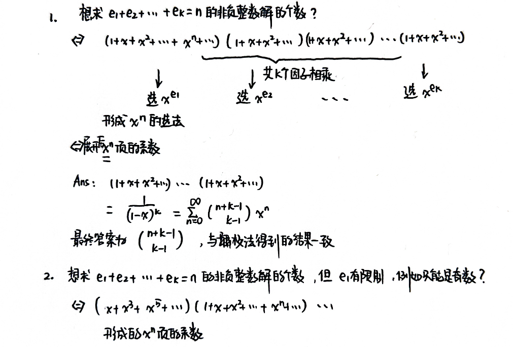
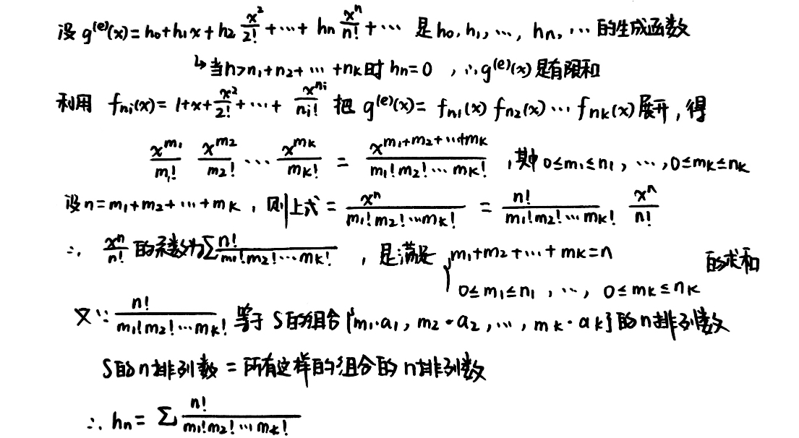

# 生成函数

前言:

维基百科上是这么定义**生成函数/母函数**的: $(a_n)_{n \in  \mathbb{N}}$ 的母函数是一种形式幂级数，其每一项的系数可以提供关于这个序列的信息。

对于某个序列 $a_0, a_1, \cdots, a_n$ ，我想找一个函数来表示它，假设是 $G(x) = a_0 + a_1 x + a_2 x^2 + \cdots a_n x^n$。这时候函数第 $i$ 项的**系数**就表示了序列中的第 $i$ 个元素。同时我们也可以看到，函数中的自变量 $x$ 好像并没有什么意义，他的取值并不影响序列的表示，我们称这种函数为**形式幂级数**。

生成函数 (Generating function) 的幂级数的系数给出计数问题的解，还有，可以求解斐波那契数列的通项（梦回高一～）（见下文）

## 数列

### 圆区域

确定平面一般位置上的 $n$ 个互相交叠的圆所形成的区域数，其中

- 互相交叠是指每两个圆相交在不同的两个点上
- 一般位置是指不存在有一个公共点的三个圆

用 $h_n$ 表示平面一般位置上的 $n$ 个互相交叠的圆所形成的区域数，则

$h_0 = 1, h_1 = 2, h_2 = 4, \cdots$

递推关系 ($n\geqslant 2$): 第 $n$ 个圆与前 $n-1$ 个圆相交于 $2(n-1)$ 个交点，形成第 $n$ 个圆上的 $2(n-1)$ 条弧

- 每条弧把穿过的区域一分为二
- 增加了 $2(n-1)$ 个区域

因此，递推关系为 $h_n = h_{n-1} + 2 (n-1), n\geqslant 2$

### 斐波那契数列

Fibonacci 数列:

设有数列 $f_0, f_1, f_2,\cdots, f_n, \cdots$，如果 $f_0=0, f1=1$，且满足递推关系 

$$
f_n= f_{n-1}+f_{n-2},n\geqslant2
$$

称该数列为斐波那契数列。

Fibonacci数满足:

$$
f_n = \frac{1}{\sqrt{5}}(\frac{1+\sqrt{5}}{2})^n - \frac{1}{\sqrt{5}}(\frac{1-\sqrt{5}}{2})^n
$$

$$
\lim\limits_{n \rightarrow +\infty}\frac{f_{n}}{f_{n+1}} = 0.618
$$

## 生成函数

一个例子: 设 $k$ 为整数，并设数列 $h_0, h_1, h_2, \cdots, h_n, \cdots$ ，又令 $h_n$ 等于 $e_1 + e_2 + \cdots + e_k = n$ 的非负整数解的数目，则

$$
h_n = \binom{n + k - 1}{k-1}
$$

它的生成函数为

$$
g(x)=\sum\limits_{n = 0}^{\infty} \binom{n+k-1}{k-1}x^n = \frac{1}{(1-x)^k}
$$

>**第二个等号:**
>
>- Taylor展开:
>
>  $\begin{aligned}(1 - x)^{-k} = \sum\limits_{n=0}^{\infty} \binom{-k}{n}(-x)^n\end{aligned}$
>
>- 广义二项式系数的定义:
>
>​	$\begin{aligned}\binom{\alpha}{n} = \frac{\alpha(\alpha - 1)\cdots(\alpha - n + 1)}{n!}\end{aligned}$
>
>- 所以有:
>
>​	$\begin{aligned}\binom{-k}{n} = \frac{(-k)(-k-1)\cdots(-k - n + 1)}{n!} = (-1)^n \cdot \frac{k (k + 1) \cdots (k + n - 1)}{n!} = (-1)^n \binom{n + k - 1}{n}\end{aligned}$

我们用另一种方式思考第二个等号:

$$
\begin{aligned}
\frac{1}{(1-x)^k} &= \frac{1}{1-x} \times \frac{1}{1-x} \times \cdots \times \frac{1}{1-x} \\
&= (\sum\limits_{e_1 = 0}^{\infty}x^{e_1})(\sum\limits_{e_2 = 0}^{\infty}x^{e_2})\cdots(\sum\limits_{e_k = 0}^{\infty}x^{e_k})
\end{aligned}
$$

$x^{e_1}$ 是第一个因子的代表项，$x^{e_2}$ 是第二个因子的代表项，……，将这些代表项相乘，得到 $x^n$ ，且有 **$x^n$ 的系数等于 $e_1+e_2+ \cdots + e_k = n$ 的非负整数解的个数**

给我们的启示:

> 对于有限项多项式，可以用OO第一单元表达式化简的程序来展开括号 （神奇的重逢😉）

## 指数生成函数

关于单项式集合 $\{1,x,\frac{x^2}{2!},\cdots,\frac{x^n}{n!},\cdots\}$ 的生成函数称为指数生成函数。数列 $h_0, h_1, \cdots, h_n, \cdots$ 的指数生成函数定义为

$$
g^{(e)}(x) = \sum\limits_{n=0}^{\infty}h_n\frac{x^n}{n!} = h_0 + h_1x + h_2 \frac{x^2}{2!} + \cdots + h_n \frac{x^n}{n!} + \cdots
$$

例子: 数列 $1, 1, \cdots, 1, \cdots$ 的指数生成函数是 $g^{(e)}(x) = \sum\limits_{n=0}^{\infty}\frac{x^n}{n!} = e^x$

### 多重集的排列

生成函数可以求解多重集的组合问题，而指数生成函数则和多重集的排列相关

`定理` 设 $S$ 是多重集合 $\{n_1 \cdot a_1, n_2 \cdot a_2, \cdots, n_k \cdot a_k\}$，其中 $n_1, n_2, \cdots, n_k$ 是非负整数。设 $h_n$ 是 $S$ 的 $n$ 排列数，那么数列 $h_0, h_1, \cdots, h_n, \cdots$ 的指数生成函数由下式给出:
$$
g^{(e)}(x) = f_{n_1}(x) f_{n_2}(x) \cdots f_{n_k}(x)
$$
其中，对于 $i = 1, 2, \cdots, k$ ，有
$$
f_{n_i}(x) = 1 + x + \frac{x^2}{2!} + \cdots + \frac{x^{n_i}}{n_i!}
$$
`证明`

证明的思路是: 先取多重集的组合，再求组内全排列

利用这个定理，可以算带有限制的多重集排列问题。

> 一个简洁的 $h_n$ 的公式暗示有可能存在求解这个问题的更直接的方法。

## 求解线性齐次递推关系

### 线性递推关系

设 $h_0, h_1, \cdots, h_n, \cdots$ 是一个数列，称这个数列满足 **$k$ 阶线性递推关系**是指存在 $a_1, a_2, \cdots, a_k(a_k \neq 0)$ 和 $b_n$ ($a_1, \cdots, a_k, b_n$ 都可能依赖于 $n$)，使得
$$
h_n = a_1h_{n-1}+a_2h_{n-2}+\cdots + a_kh_{n-k}+b_n \space (n \geqslant k)
$$
如果 $b_n=0$ ，我们称线性递推关系是**齐次的** (homogeneous)

如果 $a_1, a_2, \cdots, a_k$ 是常数，则称线性递推关系是**常系数的** (constant coefficient)

本章讨论求解**常系数线性齐次递推关系**的方法，主要有两种方法:

- 特征方程法: 注意特征方程有重根的情况
- 生成函数法: 常常要使用部分分式法

### 特征方程法

多项式方程 7.30 称为递推关系的特征方程 (characteristic equation) ，它的 $k$ 个根称为特征根 (characteristic root)

现证明 7.31 在 $q_1, q_2, \cdots, q_k$ 不同的时候，是定理 7.29 的通解:

### 有重根的情况

例子: 求递推关系 $h_n-4h_{n-1}+4h_{n-2}=0\space(n\geqslant2)$ 的通解

解: 易得 $h_n=2^n$ 是一个解，下证 $h_n=n2^n$ 也是一个解
$$
\begin{aligned}h_n-4h_{n-1}+4h_{n-2}&=n2^{n}-4(n-1)2^{n-1}+4(n-2)2^{n-2}\\&=n2^n-2n2^{n-1}+2^{n+1}+n2^n-2^{n+1}=0\end{aligned}
$$
更一般地，如果 $q$ (可能是复数) 是常系线性齐次递推关系的特征方程的 $s$ 重根，那么可以证明 
$$
h_n=q^n, h_n=nq^n, h_n=n^2q^n\cdots, h_n=n^{s-1}q^n
$$
每一个都是特征方程的解

### 生成函数法

例子: 求解递推关系 
$$
h_n = 5h_{n-1} - 6 h_{n-2} \space (n \geqslant 2)
$$
初始条件是 $h_0=1, h_1=2$

解: 我们把递推关系写成 $h_n - 5h_{n-1} + 6h_{n-2} = 0$ 

设 $g(x)$ 是 $\{h_n\}$ 的生成函数，并且我们分别用 $-5x$ 和 $6x^2$ 乘以 $g(x)$ ，得

把3个方程加起来，得到
$$
(1-5x+6x^2)g(x)=h_0+h_1x-5h_0x=1-7x
$$
后面的项全部消掉

> 神奇！

### 常系数非齐次线性递推关系

例子 (汉诺塔问题): $h_n$ 是转移 $n$ 个圆盘所需移动次数，有 $h_0=0,h_1=1,h_2=3$ ，且有递推关系:
$$
h_n=2h_{n-1}+1
$$
解法1 (直接递推) :

解法2 (生成函数) : 设 $g(x) = \sum\limits_{n=0}^{\infty}h_nx^n$
$$
\begin{aligned}
g(x)&=h_0+h_1x+h_2x^2+\cdots + h_nx^n\\
-2xg(x)&=-2h_0x-2h_1x^2-2h_2x^3-\cdots-2h_nx^{n+1}
\end{aligned}
$$
两式相加，得
$$
(1-2x)g(x)=x+x^2+\cdots+x^n+\cdots = \frac{x}{1-x}
$$
解法3 (类似微分方程) : 先求 $h_n=2h_{n-1}$ 的通解，为 $h_n=c2^n$；再求 $h_n=2h_{n-1}+1$ 的特解，设为 $h_n=k$ ，则 $k=2k+1$。最后通解+特解

特解的形式:

