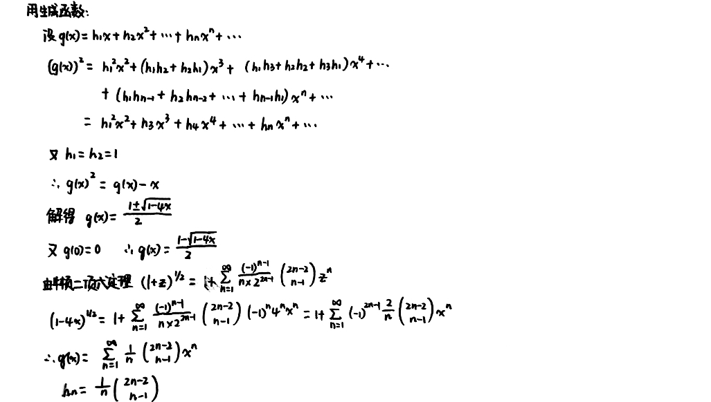

# 特殊计数序列

## Catalan数

### 一个几何例子

`定义` 

凸集: 设有平面或空间中的点集 $K$，若 $K$ 中任意两点 $p$ 和 $q$ 的连线上的所有点都在 $K$ 内，则称 $K$ 是凸集

对角线: 多边形区域连接两个非邻接顶点的线段

假设 $K$ 是凸集，则 $K$ 的每一条对角线都完全落入 $K$ 内。

- $K$ 的每条对角线把 $K$ 分成两个区域: $j$ 条边的凸多边形和 $n-j+2$ 条边的区域

  
  

共有多少种划分方法？

`定理`

设 $h_n$ 表示用下面方法把凸多边形区域分成三角形区域的方法数: 在有 $n+1$ 条边的凸多边形区域内通过插入不相交的对角线而把它分成三角形区域。定义 $h_1=1$，则 $h_n$ 满足递推关系

$$
h_n = h_1h_{n-1}+h_2h_{n-2}+\cdots h_{n-1}h_1=\sum\limits_{k=1}^{n-1}h_kh_{n-k}\space (n\geqslant 2)
$$

这个递推关系的解是
$$
h_n = \frac{1}{n}\binom{2n-2}{n-1} \space (n=1, 2, \cdots)
$$
`证明`

$n=2$ 时，因为“三角形”区域没有对角线，不能再分，所以 $h_2 = 1$ ，进而 $h_2 = h_1 h_1$，递推关系成立

假设 $n\geqslant 3$ 时递推关系成立，对于 $n+1$ 条边的凸多边形，选出一条基边，剩余 $n-1$ 个顶点分别与基边构成三角形

共有 $h_n = \sum\limits_{k=1}^{n-1}h_k h_{n-k}$ ，递推关系得证

再求 $h_n$ 的解

> $n+1$ 条边的凸多边形分成三角形区域的方法数 $=$ $h_n =$ 第 $n-1$ 个Catalan数 $C_{n-1}$ 

### Catalan数

Catalan数是序列 
$$
C_0, C_1, \cdots, C_n, \cdots
$$
其中
$$
C_n = \frac{1}{n+1}\binom{2n}{n}
$$
$C_{n-1} = \frac{1}{n}\binom{2n-2}{n-1}$ 在上面出现过

满足递推关系: 
$$
C_n = C_0 C_{n-1} + C_1 C_{n-2} + \cdots + C_{n-1}C_0
$$
### Catalan数的应用

**Q1: 矩阵相乘的括号化**

矩阵连乘 $P=M_1\times M_2 \times \cdots \times M_n$ ，用括号表示成对的乘积 (一次只能算两个矩阵的乘积，括起来形成表达式树)
$$
(M_1 \times M_2 \times \cdots \times M_k) \times (M_{k+1} \times \cdots \times M_n)
$$
我们只看最后一步的✖️的位置 (位置不同必然加括号的方式不同)。设 $n$ 个矩阵连乘的加括号方法数为 $h_n$ ，则
$$
h_n = h_1h_{n-1}+h_2h_{n-2}+\cdots h_{n-1}h_1
$$
所以有 $h_n = C_{n-1} = \frac{1}{n} \binom{2n-2}{n-1}$

**Q2: 出栈次序**

无穷大的栈的进栈序列为 $1, 2, \cdots, n$ ，问有多少不同的出栈序列？

### 其他计数问题

可以通过 $C_n = C_0C_{n-1} + C_1C_{n-2}+\cdots$ 这样的递推关系发现Catalan数，是否有其他判断Catalan数列的方法？

`定理` 考虑由 $n$ 个 $+1$ 和 $n$ 个 $-1$ 构成的 $2n$ 项序列
$$
a_1, a_2, \cdots, a_{2n}
$$
其部分和总满足 $a_1+a_2+\cdots + a_k \geqslant 0 \space (k=1,2,\cdots, 2n)$，序列的个数等于第 $n$ 个Catalan数 
$$
C_n = \frac{1}{n+1}\binom{2n}{n}
$$
`证明`

**Q3: 买票找零**

2n个人买票，n个人有50元，n个人有100元，怎么排队才始终能找零？

任意时刻，50的人数都要 $\geqslant$ 100的人数，部分和序列均 $\geqslant 0$

### 拟Catalan数

定义新的数列:
$$
C_1^{*}, C_2^{*}, \cdots, C_n^{*}, \cdots
$$

满足:
$$
C_n^{*}=n!C_{n-1}
$$

## 差分序列

可以求解这类问题: $1^p+2^p+3^p+\cdots n^p$

### 差分序列

设 $h_0, h_1, \cdots, h_n, \cdots$ 是一个序列，我们定义其一阶差分序列为 $\Delta h_0, \Delta h_1, \cdots, \Delta h_n, \cdots$，其中
$$
\Delta h_n = h_{n+1}-h_n \space (n\geqslant 0)
$$
还可以定义 $p$ 阶差分序列，
$$
\Delta^ph_n = \Delta(\Delta^{p-1}h_n)
$$
0阶差分序列就是自己

`定理` 设序列的通项是 $n$ 的 $p$ 次多项式，即 $h_n = a_pn^p+a_{p-1}n^{p-1}+\cdots a_1 n + a_0$ ，则对所有的 $n\geqslant 0$ ，$\Delta^{p+1}h_n = 0$

`性质` 差分表可以由第0行或第0条对角线确定

我们来看一些特殊的第0条对角线:

**第0条对角线除1个 $1$ 外都是 $0$:**

例如: $p=4$ 时，

因为第5行起均为0，所以 $h_n$ 应该是 $4$ 次多项式，而且有 $h_0 = h_1 = h_2 = h_3 = 0$ ，所以设
$$
h_n = cn(n-1)(n-2)(n-3)
$$
又 $h_4 = 1$ ，所以 $c(4)(3)(2)(1) = 1$ ，因此有
$$
h_n = \frac{n(n-1)(n-2)(n-3)}{4!} = \binom{n}{4}
$$
`定理` 

差分表的第0条对角线等于
$$
c_0, c_1, c_2, \cdots, c_p, 0, 0, \cdots, 其中c_p \neq 0
$$
的序列的通项是满足
$$
h_n = c_0 \binom{n}{0} + c_1 \binom{n}{1} + c_2 \binom{n}{2} + \cdots + c_p \binom{n}{p}
$$
的 $p$ 次多项式

### 求解部分和

$$
\begin{aligned}
\sum\limits_{k=0}^{n}h_k &= h_0+h_1 +\cdots + h_n\\
&= c_0 \sum\limits_{k=0}^n\binom{k}{0}+c_1 \sum\limits_{k=0}^n\binom{k}{1}+\cdots + c_p \sum\limits_{k=0}^n\binom{k}{p}
\end{aligned}
$$

我们又知道
$$
\sum\limits_{k=0}^n\binom{k}{p} = \binom{n+1}{p+1}
$$
(有 $n+1$ 个元素的集合 $S = \{0,1, \cdots, n\}$ 选 $p+1$ 个元素，假设最大的元素是 $k$，然后再从前面的 $0$ 到 $k-1$ 中选 $p$ 个)

因此
$$
\sum\limits_{k=0}^{n}h_k = c_0 \binom{n+1}{1} + c_1 \binom{n+1}{2} + \cdots + c_p\binom{n+1}{p+1}
$$

## 第二类Stirling数

### 定义

> 考虑 $n^p$ 差分序列的对角线

设 $h_n = n^p$ ，差分表的第0条对角线为 $c(p,0),c(p,1),\cdots,c(p,p),0,0,\cdots$

特别地，当 $p=0$ ，$h_n = n^0 = 1$ ，所以 $c(0,0) = 1$。当 $p \geqslant 1$ ，有 $c(0,0) = 0^p = 0$

引入 $n$ 个不同对象的 $k$ 排列数的新记号 $[n]_k$ ，则 
$$
n^p = c(p,0)\frac{[n]_0}{0!}+c(p,1)\frac{[n]_1}{1!}+\cdots+c(p,p)\frac{[n]_p}{p!}
$$
引入 
$$
S(p,k) = \frac{c(p,k)}{k!} \space (0 \leqslant k \leqslant p)
$$
$S(p,k)$ 就叫做第二类Stirling数

`性质`

1. 若 $p = 0$，$S(p, 0) = 1$ ；若 $p\geqslant 1$，$S(p,0) = 0$
2. 左边 $n^p$ 项的系数为 $1$ ，而右边只有 $c(p,p)\frac{[n]_p}{p!}$ 贡献 $n^p$ 项，所以，$\frac{c(p,p)}{p!} = 1$

`定理`

如果 $1\leqslant k \leqslant p-1$ ，则
$$
S(p, k) = k S(p-1, k) + S(p-1, k-1)
$$
发现第二类Stirling数满足 Pascal-like 的递推关系 (不看系数 $k$ 不就是 Pascal 么)

`证明`

画出类帕斯卡三角形:

第二类Stirling数，例如 $S(5,2)$，可以直接用

### 组合解释

`定理` 第二类Stirling数 $S(p,k)$ 计数的是把 $p$ 元素集合划分到 $k$ 个不可区分的盒子且没有空盒子的划分个数

`证明`

设 $S^*(p,k)$ 表示把 $p$ 元素集合划分到 $k$ 个不可区分的盒子且没有空盒子的划分个数，首先有 $S^*(p,p)=1 (p\geqslant 0)$ 和 $S^*(p,0) = 0(p\geqslant 1)$ ，我们现在只需要证 $S^*(p,k) = kS^*(p-1,k) + S^*(p-1,k-1)$

假设分的是集合 $\{1,2,\cdots,p\}$ ，关注 $1$ ，有两类分法:

- $1$ 自己单独在一个盒子，有 $S^*(p-1,k-1)$ 种
- $1$ 不是自己单独在一个盒子，有 $kS^*(p-1,k)$ 种

### 计算第二类Stirling数

如果把分到 $k$ 个**可区分**的盒子且没有空盒的划分个数记为 $S^{\#}(p,k)$ ，这个数是可以由容斥原理得到的，进而可以算出 $S(p,k)$

`定理` 对每一个满足 $0\leqslant k \leqslant p$ 的正整数 $k$ ，都有
$$
S^{\#}(p,k) = \sum\limits_{t=0}^{k}(-1)^t\binom{k}{t}(k-t)^p
$$
`证明` 设 $U$ 是把 $\{1, 2, \cdots, p\}$ 分到 $k$ 个可区分盒子 $B_1, B_2, \cdots, B_k$ 的所有划分的集合，有 $|U| = k^p$。定义性质 $P_i$ 是盒子 $B_i$ 为空，$A_i$ 是具有性质 $P_i$ 的划分的集合

第二类Stirling数满足以下关系:
- $n \geqslant 2$ 时，$S(n,2) = 2^{n-1}-1$
  - 我们固定一个元素，其他元素如果和他一堆，就记为 1，不和他一堆，则记为 0
  - 这样就得到了01序列，有 $2^{n-1}$ 种
  - 去掉所有元素在一堆的情况
- $n \geqslant 1$ 时，$S(n,n-1)=\binom{n}{2}$
  - 选两个元素在一堆，其余元素都单独一堆
- $n\geqslant 2$ 时，$S(n,n-2)=\binom{n}{3}+3\binom{n}{4}$
  - 第一种情况: 3个元素一堆，剩余的n-3个元素各自一堆
  - 第二种情况: 2/2/剩n-4个元素一堆

## Bell数

Bell数是将 $p$ 元素集合分到非空且不可区分盒子的划分个数 (没有指定盒子的数目)
$$
B_p = S(p,0) + S(p,1) + \cdots + S(p,p)
$$
`定理`
$$
B_p = \binom{p-1}{0}B_0 + \binom{p-1}{1}B_1 + \cdots + \binom{p-1}{p-1}B_{p-1}
$$
`证明` 固定一个元素 $p$ ，还有 $\{1,2,\cdots, p-1\}$ 之中的元素也在同样的盒子里

## 第一类Stirling数

我们之前算的是 $n^p = f([n]_1, [n]_2, \cdots, [n]_p)$ ，然后又观察 $[n]_2 = n(n-1) = n^2 - n$ ，所以想 $[n]_p = g(n^p, n^{p-1}, \cdots , n^0)$

$$
[n]_p = s(p,p)n^p-s(p,p-1)n^{p-1}+\cdots + (-1)^{p-1}s(p,1)n^1+(-1)^ps(p,0)n^0
$$
定义第一类Stirling数为系数 $s(p,k)$ 。$s(p,0) = 0\space(p\geqslant 1)$ ，$s(p,p) = 1$

`定理` 对 $1 \leqslant k \leqslant p-1$ ，有
$$
s(p,k) = (p-1)s(p-1,k) + s(p-1,k-1)
$$
`定理` 第一类 Stirling 数 $s(p,k)$ 计数的是把 $p$ 个对象排成 $k$ 个非空循环排列的方法数

## 分拆数

>$n$ 的分拆 (partition) 就是把 $n$ 写成多个正整数的和，例如 $4$ 的分拆: $4,3+1,2+2,2+1+1,1+1+1+1$

### 定义与性质

正整数 $n$，$\{n_1,n_2,\cdots,n_k\}$ 是 $n$ 的一个分拆:

$$
n_1+n_2+\cdots+n_k=n
$$

- $n_i:$ $n$ 的一个部分
- $p_n^k:$ $n$ 的所有包含 $k$ 个部分的不同分拆的个数
- 分拆数 $p_n = \sum\limits_{k=1}^{n}p_n^k:$ $n$ 的所有不同分拆的个数

$n = na_n+(n-1)a_{n-1}+\cdots+2a_2+1a_1$，记为 $\lambda = n^{a_n}\cdots2^{a_2}1^{a_1}$

$p_n^k$ 满足递推关系: $\sum\limits_{j=1}^{k}p_n^j=p_{n+k}^k$

### 一些定理

$p_n{(r)}:$ 最大部分为 $r$ 的 $n$ 的分拆数量

$q_n(r):$ 分拆各部分不大于 $r$ 的 $n-r$ 的分拆数量

可以发现一一对应关系，所以得到 
$$
p_n(r) = q_n(r)
$$

> 后面的其他证明不知是否有一一对应

### Ferrers图

10=4+2+2+1+1

分拆 $\lambda$ 的共轭分拆 (conjugate partition) $\lambda^*:$ 把Ferrers进行转置 

`分拆数定理` 正整数 $n$ 分成 $k$ 个部分的分拆个数，等于 $n$ 分成以 $k$ 为最大部分的分拆个数

### 自共轭分拆

$\lambda$ 与 $\lambda^*$ 完全相同

$p_n^s:$ $n$ 的自共轭分拆数

$p_n^t:$ 分拆为互不相同的奇数的和的分拆个数
$$
p_n^s = p_n^t
$$

### 欧拉恒等式

$p_n^o:$ 把 $n$ 分成奇数个部分的分拆个数

$p_n^d:$ 把 $n$ 分成不同部分的分拆个数

`欧拉恒等式`
$$
p_n^o = p_n^d
$$

### 分拆数的计算

生成函数 $g(x) = \sum\limits_{n=0}^{\infty}p_nx^n = \prod\limits_{k=1}^{\infty}(1-x^k)^{-1}$

【例题】已知某三种商品的价格分别是1元、2元和4元，现用100元去购买这三种商品，若100元刚好花完，则不同的购买方案共有多少种？

