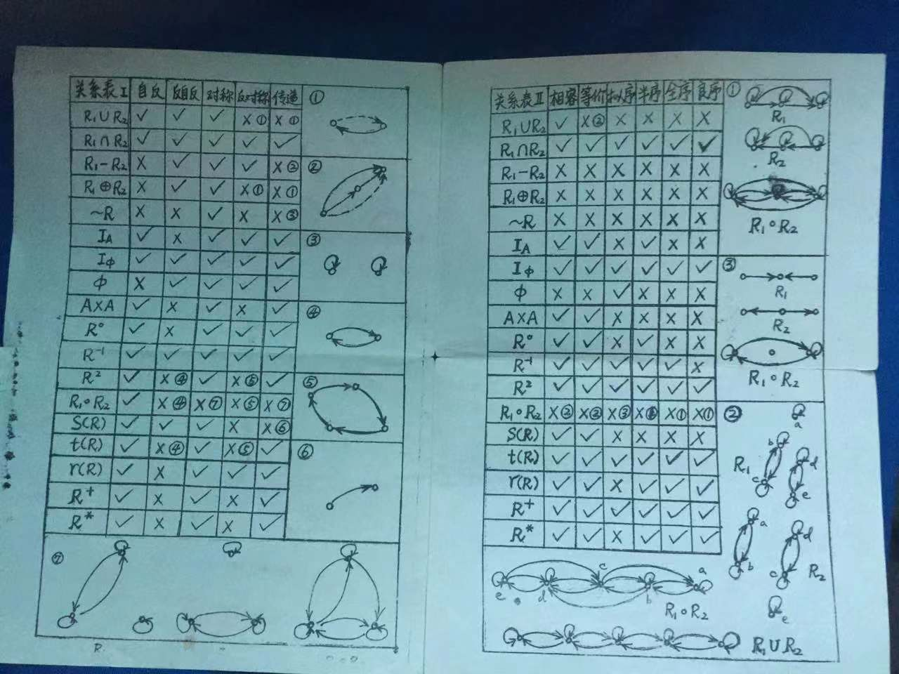

# 笔记｜关系

## 定义与性质

### 一些定义

`定义` 若 $R$ 是 $X \times Y$ 的子集，则称 $R$ 为 $X$ 到 $Y$ 的关系

>$R$ 是"关系池"，里面包含有这种关系的有序偶。关系是集合，可以进行运算

$R$ 的定义域 $\mathrm{dom}(R) = \{x | \langle x,y\rangle \in R\}$

$R$ 的值域 $\mathrm{ran}(R) = \{y | \langle x,y\rangle \in R\}$

>定义域是 $R$ 实际取到的 $x$ 们

逆关系 $R^{-1} = \{\langle x,y\rangle | \langle y,x\rangle \in R\}$

复合关系: $R \subseteq X \times Y, S \subseteq Y \times Z$，则 $R \circ S = \{\langle x,z\rangle  | \exists y \in Y st \langle x,y\rangle \in R \wedge \langle y,z\rangle  \in S\}$

### 关系的性质

- $R$ 是自反的 $\iff$ $\forall x(x \in X \rightarrow \langle x,x\rangle  \in R)$
- $R$ 是反自反的 $\iff$ $\forall x(x \in X \rightarrow \langle x,x\rangle  \notin R)$
- $R$ 是对称的 $\iff$ $\forall x \forall y(\langle x,y\rangle  \in R \rightarrow \langle y,x\rangle  \in R)$
- $R$ 是反对称的 $\iff$ $\forall x \forall y(\langle x,y\rangle  \in R \wedge \langle y,x\rangle  \in R \rightarrow x = y)$ 
  
  $\iff$ $\forall x \forall y(\langle x,y\rangle  \in R \wedge x \neq y \rightarrow \langle y,x\rangle  \notin R)$
- $R$ 是传递的 $\iff$ $\forall x \forall y \forall z(\langle x,y\rangle  \in R \wedge \langle y,z\rangle  \in R \rightarrow \langle x,z\rangle  \in R)$

>当 $X$ 是 $\varnothing$，其上的空关系会满足以上所有性质。所以完美的东西可能是不存在的～

`引理` 有关五大性质

- $R$ 自反 $\iff$ $I_A \subseteq R$
- $R$ 反自反 $\iff I_A \cap R = \varnothing$
- $R$ 对称 $\iff R = R^{-1}$
- $R$ 反对称 $\iff R \cap R^{-1} \subseteq I_A$
- $R$ 传递 $\iff R \circ R \subseteq R$ 🌟

`定理` 若 $R$ 是传递的，则 $R \circ R$ 也是传递的

## 闭包

### 定义

$R'$ 称为 $R$ 的自反闭包，当且仅当:

1. $R'$ 是自反的
2. $R \subseteq R'$
3. 对于 $A$ 上的任何自反关系 $R''$，若 $R \subseteq R''$，则 $R' \subseteq R''$ (极小化: $R'$ 是包含 $R$ 且自反的最小关系)

类似定义对称闭包&传递闭包，分别记为 $r(R), s(R), t(R)$

自反闭包就是加上自圈，对称闭包是把单边变成双向的，传递闭包是处处添加捷径

### 闭包的存在性

因为"全关系" $A \times A$ 是满足性质 $P$ 的，所以肯定能找到闭包

### 寻找闭包

$r(R) = R \cup I_A$

$s(R) = R \cup R^{-1}$

$t(R) = R \cup R^{2} \cup ...$

证明:

$R \subseteq r(R)$ and $I_A \subseteq r(R) \Rightarrow R \cup I_A \subseteq r(R)$

$R \cup I_A$ 有性质(1)(2) $\Rightarrow$ $r(R)$ 作为自反闭包，必有 $r(R) \subseteq R \cup I_A$

更进一步，$t(R) = R \cup R^{2} \cup ... \cup R^{n}$

### 闭包的性质

二元关系 $R_1, R_2 \subseteq A\times A$ 且 $R_1 \subseteq R_2$，则:

1. $r(R_1) \subseteq r(R_2)$
2. $s(R_1) \subseteq s(R_2)$
3. $t(R_1) \subseteq t(R_2)$

证明:

$R_1 \subseteq R_2 \subseteq r(R_2)$ 并且 $r(R_2)$ 是自反的 $\Rightarrow r(R_2)$ 满足性质(1)(2)，而 $r(R_1)$ 是最小满足的

$R \subseteq A \times A$:

1. 若 $R$ 是自反的，则 $s(R),t(R)$ 也是自反的
2. 若 $R$ 是对称的，则 $r(R),t(R)$ 也是对称的
3. 若 $R$ 是传递的，则 $r(R)$ 也是传递的

证明:

$R$ 自反 $\Rightarrow I_A \subseteq R \Rightarrow I_A \subseteq R \cup R^{-1} = s(R)$ and $I_A \subseteq R \cup R^{2}\cup ... = t(R)$

$R$ 对称 $\Rightarrow R = R^{-1} \Rightarrow r^{-1}(R) = (R \cup I_A)^{-1} = R^{-1} \cup I_A^{-1} = R \cup I_A = r(R)$

$R$ 传递 $\Rightarrow R \circ R \subseteq R \Rightarrow (R \cup I_A) \circ (R \cup I_A) = R \circ R \cup R \cup I_A \subseteq (R \cup I_A)$

设 $R =\{\langle 1,2 \rangle\}$ 传递，但 $s(R) = \{\langle 1,2 \rangle, \langle 2,1 \rangle\}$ 缺少 $\langle1,1\rangle , \langle2,2\rangle$ 的捷径，$s(R)$ 不一定传递

>$R$ 的美妙性质能透过闭包

$R \subseteq A \times A$:

1. $rs(R) = sr(R)$
2. $rt(R) = tr(R)$
3. $st(R) \subseteq ts(R)$

证明:

$s(R) \subseteq s(r(R))$，又 $r(R)$ 自反，所以 $sr(R)$ 自反，必"大于"自反闭包 $rs(R)$，即得到 $rs(R) \subseteq sr(R)$

## 复合关系的定义域和值域

$R \subseteq X \times Y, A \subseteq X, B \subseteq Y$，记 

$R[A] = \{y\in Y|\exists x \in A \space st \space\langle x,y \rangle \in R\}$, 

$R^{-1}[B] = \{x\in X|\exists y \in B \space st \space\langle x,y \rangle \in R\}$

>光源要在 $A$ 中，影子要在 $B$ 中

若 $R \subseteq X \times Y, S \subseteq Y \times Z$，则 $\mathrm{dom}(R \circ S) = R^{-1}[\mathrm{dom}S]$, $\mathrm{ran}(R \circ S) = S[ranR]$

## 次序关系

### 次序关系

`偏序关系`: $R \subseteq P \times P$ 称为偏序关系当且仅当 $R$ 是 `自反的`，`反对称的` 和 `传递的`

- $\leq$ 表示偏序关系，$\langle P, \leq \rangle$ 表示偏序结构
- 例如: $\langle \mathscr{P}(A), \subseteq \rangle$ 是偏序结构

`全序关系`: 设 $\langle P, \leq \rangle$ 是偏序结构，若对任意 $x,y \in P$，或者 $x \leq  y$，或者 $y \leq x$，则称 $\leq$ 为 $P$ 上的全序，称 $\langle P, \leq \rangle$ 为全序集合/链

`严格偏序/拟序关系`: 反自反+传递 (必然有反对称)

- $<$ 表示严格偏序关系
- 偏序去掉自身即为拟序

### 哈斯图

$y$ 遮盖 $x \iff x < y \wedge \neg \exists z(x < z \wedge z < y)$ 
- $P$ 的元素用点表示
- 若 $x < y$，则 $x$ 画在 $y$ 下
- 若 $y$ 遮盖 $x$，在 $x,y$ 间连线 (遮盖即靠得最近)

>$\langle x,y \rangle$ 有关系，可以记为 $\langle x,y \rangle \in R$ 或 $xRy$，而记录偏序，我们采用第二种方式，更加直观

### 偏序中的特殊元素

最大元 & 极大元:

>最大元要求只要在 $B$ 中，就比 $b$ 小，$b$ 必须和所有元素比；极大元要求能比较的，最终 $b$ 都比赢了

上界:

### 良序结构

偏序结构 $\langle P, \leq \rangle$，如果 $P$ 的每个非空子集都有最小元，则称 $\leq$ 为良序关系

- 良序 $\Rightarrow$ 全序
- 例如: $\langle Q_+,\leqslant \rangle$ 的子集 $Q_+$ 没有最小元，所以不是良序(有穷的全序一定是良序的)

!!! info "Question"
    什么样的全序会成为良序呢⬇️

`定理1` $\leq$ 为 $P$ 上的偏序关系，则 $\leq$ 为 $P$ 上的良序关系当且仅当:

1. $\leq$ 为 $P$ 上的全序
2. $P$ 的每个非空子集都有极小元

>最小元是在极小中找能比完的，而全序可以满足

`定理2` $\langle A, \leq \rangle$ 为全序结构，则 $\leq$ 为 $A$ 上的良序关系的充要条件是: 不存在 $A$ 中元素的无穷序列 $a_0, a_1, a_2, \cdots$ 使得每个 $i\in N$ 皆有 $a_{i+1} < a_{i}$ (不存在无穷递降序列)

证明:

逆否命题: 不是良序 $\iff$ 存在无穷递减的 $a_0, a_1, a_2, \cdots$

## 等价关系与划分

>党代表来啰

### 等价关系

`定义` 如果集合 $A$ 的关系 $R$ 是自反、对称、传递的，则称 $R$ 为 $A$ 上的 `等价关系`

- 例如: 模3同余关系

等价类 $[x]_R$: $R$ 是等价关系，对每个 $x \in A$，$A$ 中与 $x$ 有关系 $R$ 的元素的集合称为 $x$ 关于 $R$ 的等价类

- $[x]_R = \{y|xRy\}$
- 例如: $A = \{1,2,3, \cdots, 7\}$ 上的模3同余，$[1]_R = [4]_R = [7]_R = \{1, 4, 7\}$

商集: 所有等价类组成的集合，记作 $A/R$

- $A/R = \{[x]_R|x\in A\}$
- 上例中 $A/R =\{\{1,4,7\}, \{2,5\}, \{3,6\}\}$

### 划分 

$\pi \subseteq \mathscr{P}(A)$ (元素是 $A$ 的若干子集)，若 $\pi$ 满足以下条件则称 $\pi$ 为 $A$ 的一个 `划分`:

1. 对每个 $S \in \pi$，$S \neq \varnothing$
2. 任意 $B, C \in \pi$，若 $B \neq C$，则 $B \cap C = \varnothing$
3. $\cup \pi = A$

例如: $B = \{\{1,2,3\}, \{4,5\}, \{6,7\}\}$ 是上例 $A$ 的一个划分

>分蛋糕🍰

### 等价关系 & 划分

`定理` 非空集合 $A$ 上的等价关系 $R$ 决定了 $A$ 上的一个划分，这个划分就是 $A/R$

`定理` $\pi$ 是 $A$ 上的一个划分，若令 $R_{\pi} = \{\langle x,y\rangle|\exists S \in \pi \space st. \space x,y \in S\}$，则 $R_{\pi}$ 必是 $A$ 上的等价关系且 $A/R_{\pi} = \pi$

证明:

先证 $R_{\pi}$ 是等价关系，再证 $A / R_{\pi} = \pi$。

先证 $\pi \subseteq A / R_{\pi}$，任取 $S \in \pi$ 及 $x \in S$:

若 $y \in S$，则 $\langle x,y \rangle \in R_{\pi}$，则 $y \in [x]_{R_{\pi}}$；若 $y \in [x]_{R_{\pi}}$，则 $x,y \in S$。所以有 $S = [x]_{R_{\pi}}$。由 $[x]_{R_{\pi}} \in A / R_{\pi}$ 有 $S \in A / R_{\pi}$

再证 $A / R_{\pi} \subseteq \pi$，任取 $[x]_{R_{\pi}} \in A / R_{\pi}$:

$\pi$ 是划分，则必有 $S \in \pi$ 使得 $x \in S$，必有 $[x]_{R_{\pi}} = S$，所以 $[x]_{R_{\pi}} \in \pi$

>$R_{\pi}$ 在一堆一堆的元素中加了箭头

## 题目

T1. $R$ 是 $A$ 上的二元关系，则 $str(R)$ 是 $A$ 上的等价关系? ($\times$)

$R = \{\langle 1,3 \rangle , \langle 2,3 \rangle\}$

$r(R) = \{\langle 1,3 \rangle , \langle 2,3 \rangle, \langle 1,1 \rangle, \langle 2,2 \rangle, \langle 3,3 \rangle\}$

$tr(R) = \{\langle 1,3 \rangle , \langle 2,3 \rangle, \langle 1,1 \rangle, \langle 2,2 \rangle, \langle 3,3 \rangle\}$

$str(R) = \{\langle 1,3 \rangle , \langle 3,1 \rangle, \langle 2,3 \rangle,\langle 3,2 \rangle, \langle 1,1 \rangle, \langle 2,2 \rangle, \langle 3,3 \rangle\}$

缺少从 $1$ 到 $2$ 的捷径，$str(R)$ 不再传递

T2. $R$ 为 $A$ 上的等价关系，称 $n(A/R)$ 为 $R$ 的秩。证明: 若 $i, j \in I_+$ 且 $A$ 上的等价关系 $R_1$ 和 $R_2$ 的秩分别为 $i, j$，则 $R_1 \cap R_2$ 也是 $A$ 上的等价关系且 $\mathrm{max}\{i, j\} \leqslant n(A/(R_1\cap R_2)) \leqslant i \cdot j$

$A / R_1 = \{B_1, B_2, \cdots, B_i\}$

$A / R_2 = \{C_1, C_2, \cdots, C_j\}$

$S = \{B_p \cap C_q | 1 \leqslant p \leqslant i \wedge 1 \leqslant q \leqslant j \wedge B_p \cap C_q \neq \varnothing\}$

则 $A/(R_1\cap R_2) = S$，因为除去了一些空集，所以 $\leqslant$

## 葵花宝典

