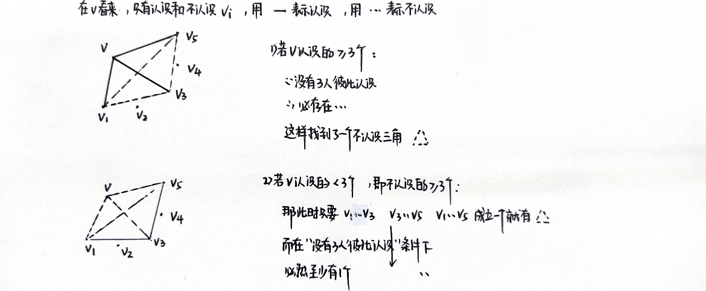

# 笔记｜图论

## 基本概念

### 无向图、有向图

设 $V,E$ 是有限集合，$V \neq \varnothing$，

如果 $\psi: E \rightarrow \{\{v_1, v_2\}|v_1,v_2 \in V\}$，则称 $G = \langle V,E,\psi \rangle$ 为 `无向图`

如果 $\psi: E \rightarrow V \times V$，则称 $G = \langle V,E,\psi \rangle$ 为 `有向图`

>$\psi(e) = \{v_1,v_2\}$

注意:

- $E$ 可以为空
- 一个 $E$ 中元素可以对应两个相同的 $V$ 中元素 $\Rightarrow$ `自圈`
- 多个 $E$ 中的元素可映射到 $V$ 中相同元素 $\Rightarrow$ `平行边`

$V$ 中的元素称为图 $G$ 的 `结点`，$E$ 的元素称为图 $G$ 的 `边`，图 $G$ 的结点数目称为它的 `阶`

### 关联、邻接——结点和边的关系

设无向图 $G = \langle V,E,\psi \rangle$，$e,e_1,e_2\in E$ 且 $v_1,v_2 \in V$:

如果 $\psi(e) = \{v_1, v_2\}$，则称 $e$ 与 $v_1$ (或 $v_2$) 互相 `关联`，$v_1,v_2$ `邻接`

如果两条不同的边 $e_1$ 和 $e_2$ 与同一个结点关联，则称 $e_1$ 和 $e_2$ `邻接`

有向图类似

### 自圈、平行边、简单图

设图 $G = \langle V,E,\psi \rangle$，$e_1,e_2$ 是 $G$ 的两条不同边:

如果与 $e_1$ 关联的两个结点相同，则称 $e_1$ 为 `自圈`

如果 $\psi(e_1) = \psi(e_2)$，则称 $e_1$ 与 $e_2$ `平行`

如果图 $G$ 既没有自圈，也没有平行边，则称 $G$ 为 `简单图`

>架两座桥是没有意义的，不会影响图的连通性

### 度

设 $v$ 是图 $G$ 的结点:

如果 $G$ 是无向图，$G$ 中与 $v$ 关联的**边**和与 $v$ 关联的**自圈**的数目之和称为 $v$ 的 `度`，记为 $\mathrm{d_G}(v)$

>自圈算 $2$ 个度

如果 $G$ 是有向图，$G$ 中以 $v$ 为起点的边的数目称为 $v$ 的 `出度`，记为 $\mathrm{d_G}^{+}(v)$，以 $v$ 为终点的边的数目称为 $v$ 的 `入度`，记为 $\mathrm{d_G}^{-}(v)$

度 $\mathrm{d_G}(v) = \mathrm{d_G}^{+}(v) + \mathrm{d_G}^{-}(v)$

规律: 每增加一条边，所有结点度数之和 $+2$

`定理` 设无向图 $G = \langle V,E,\psi \rangle$ 有 $m$ 条边，则 $\sum\limits_{v \in V} \mathrm{d_G}(v) = 2m$

`定理` 设有向图 $G = \langle V,E,\psi \rangle$ 有 $m$ 条边，则 $\sum\limits_{v \in V} \mathrm{d_G}^{+}(v) =\sum\limits_{v \in V} \mathrm{d_G}^{-}(v)= m,\sum\limits_{v \in V} \mathrm{d_G}(v)=2m$

### 奇结点、偶结点

度为奇数的结点称为 `奇结点`；度为偶数的结点称为 `偶结点`。

`定理` 任何图中都有偶数个奇结点

>反证法，奇数个的话总度数会为奇数

### 孤立点、端点

度为 $0$ 的结点称为 `孤立点`；度为 $1$ 的结点称为 `端点`。

### 零图、平凡图、d度正则图、完全图

定义一些特殊图:

1. 结点都是孤立点的图称为 `零图` (都是孤岛)
2. 一阶零图称为 `平凡图` (图只有一个孤立点)
3. 所有结点的度均为自然数 $d$ 的**无向图**称为 `d度正则图`
4. 如果 $n$ 阶简单无向图 $G$ 是 n-1 度正则图， 则称 $G$ 为 `完全无向图`，记为 $K_n$
5. 每个结点的出度和入度均为 $n-1$ 的 n 阶简单有向图称为 `完全有向图`
   
### 思考题

证明: 在任意六个人中，若没有三个人彼此都认识，则必有三个人彼此都不认识

### 同构

同构图的对应结点之度相等

## 子图和图的运算

### 子图、真子图、生成子图

>生成子图有相同的结点

### 由结点集导出的子图

>把点减掉后边就自然没有依附，也被减掉了

### 由边集导出的子图

### 可运算、不相交

>同名的边必须关联相同的点，这样才能合并

### 交、并、环和

### 补图

>结点是一致的

## 路径、回路和连通性

### 定义与性质

名词:

- 路径: 结点和边的序列
  - 简单路径 (边不同)
  - 基本路径 (点不同)
- 路径的另一个分类维度
  - 开路径
  - 闭路径: $v_0 = v_n$
- 可达/不可达: $v_1$ 可达/不可达 $v_2$
- 测地线: 从 $v_1$ 到 $v_2$ 长度最短的路径
- 距离: 测地线的长度，记为 $d(v_1, v_2)$
- 直径: 最大的 $d$

加权图有关:

- 最短路径: 加权长度最小的路径
- 加权距离: 最短路径的加权长度

无向图:

- 连通: 任意两个结点都可到达 (即没有孤立点)

有向图:

- 基础图: 对应的无向图
- 强连通: 任意两个结点都互相可达
- 单向连通的: 任意两结点，必有一个可达另一个
- 弱连通的: 基础图是连通的

子图:

- 极大子图: 具有性质 $P$ 的子图……
- 分支
  - 无向图的极大连通子图称为 $G$ 的分支
  - 有向图的极大强连通子图称为 $G$ 的强分支
  - etc

回路:

- 回路: 连通 $2$ 度正则图
- 半回路: 基础图是回路的有向图
- 有向回路: 每个结点的出度和入度均为 $1$ 的弱连通有向图 (比半回路要求高，多了出度和入度均为 $1$) (那就是🔁?)
- 非循环图: 没有回路的无向图和没有半回路的有向图 (子图)

`定理` 设图 $G = \langle V, E,  \Psi \rangle, v, v' \in V$。如果存在从 $v$ 至 $v'$ 的路径，则存在从 $v$ 至 $v'$ 的基本路径。

`定理` 

只证 ($\Rightarrow$):

$n+1$ 阶是回路，则去掉一个点，再连上边上的两点，形成了 $n$ 阶的回路

`定理` 如果有向图 $G$ 有子图 $G'$ 满足: 对于 $G'$ 中的任意结点 $v$，$\mathrm{d}_{G'}^{+}(v)>0$，则 $G$ 有有向回路

证:

即必然有先前的点指向端点

`定理` 图 $G$ 不是非循环图当且仅当 $G$ 有子图 $G’$，使得对 $G’$ 的任意结点皆有 $\mathrm{d}_G'(v)> 1$

### $W$ 过程

判断有向图是否有有向回路: 

若 $\mathrm{d}_G^{+}(v) = 0$，则从 $G$ 中去掉和 $v$ 关联的边，不断重复，如果最终得到平凡图 (一个点)，则 $G$ 没有有向回路，反之则有

### 思考题

T1. 证明: 非连通的简单无向图的补图必连通

T2. 设 $G$ 是 $n$ 阶简单无向图，对 $G$ 的任意结点 $v$，皆有 $\mathrm{d}_G(v) \geqslant \frac{n-1}{2}$，则 $G$ 是连通的

T3. 有 $k$ 个弱分支的 $n$ 阶简单有向图至多有 $(n-k)(n-k+1)$ 条边

## 欧拉图

### 相关定义

每个结点都是**偶结点**的**无向图**称为 `欧拉图`

每个结点的**出度**和**入度**都相等的**有向图**称为 `欧拉有向图`

图 $G$ 中包含其所有边的简单开路径称为 $G$ 的 `欧拉路径` (一笔划)

图 $G$ 中包含其所有边的简单闭路径称为 $G$ 的 `欧拉闭路` (一笔划回原点)

### 欧拉定理及推广

`定理1` 设 $G$ 是连通无向图，$G$ 是欧拉图当且仅当 $G$ 有欧拉闭路

证明: $G$ 是连通欧拉图 $\Rightarrow$ 任意结点的度 $\geqslant 2 \Rightarrow$ 找长度为 $m$ 的回路 $\Rightarrow$ 还剩分支 $G_1, G_2, \cdots$，都有欧拉闭路

`定理2` 设 $G = \langle V, E, \Psi\rangle$ 为连通无向图且 $v_1, v_2 \in V$，则 $G$ 有一条从 $v_1$ 至 $v_2$ 的欧拉路径当且仅当 $G$ 恰有两个奇结点 $v_1$ 和 $v_2$

For 有向图:

`定理3` 设 $G$ 是弱连通有向图，$G$ 是欧拉有向图当且仅当 $G$ 有欧拉闭路

`定理4` 设 $G$ 是弱连通有向图，$v_1$ 和 $v_2$ 为 $G$ 的两个不同结点，$G$ 有一条从 $v_1$ 至 $v_2$ 的欧拉路径当且仅当 $\mathrm{d}_G^{+}(v_1) = \mathrm{d}_G^{-}(v_1) + 1, \mathrm{d}_G^{+}(v_2) = \mathrm{d}_G^{-}(v_2)-1$ 且对 $G$ 的其他结点 $v$ 有 $\mathrm{d}_G^{+}(v) = \mathrm{d}_G^{-}(v)$

`定理5` 如果 $G_1$ 和 $G_2$ 是可运算的欧拉图，则 $G_1 \bigoplus G_2$ 是欧拉图

>$\bigoplus$ 是拼接两图，把重合的边消去

任意结点 $v$，若 $v \in V_1$ 且 $v \in V_2$，……，否则，……

## 哈密顿图

>周游世界，经过每个城市恰好一次，回到出发点

如果回路 (有向回路) $C$ 是图 $G$ 的生成子图，则称 $C$ 为 $G$ 的 `Hamilton回路` ( `Hamilton有向回路` )

有Hamilton回路 (Hamilton有向回路) 的图称为Hamilton图 (Hamilton有向图)

图 $G$ 中包含它的所有结点的基本路径称为 $G$ 的Hamilton路径

### 一个问题

证明: 设 $n$ 为大于 $2$ 的奇数，则 $n$ 阶完全无向图有 $\frac{n-1}{2}$ 个边不相交的哈密顿回路

完全图总边数为 $\frac{n(n-1)}{2}$，一个哈密顿回路 $n$ 条边，所以最多可能有 $\frac{n-1}{2}$ 个，当 $n$ 为质数的时候，可以类似这么找:

不过当 $n$ 不是质数，怎么找呢？

## 图的矩阵表示

邻接矩阵 $X(G): x_{ij}$ 为以 $v_i$ 和 $v_j$ 为起点和终点的边的数目

路径矩阵 $P(G):$

矩阵乘法只取 $0$ 和 $1$

距离矩阵 $D(G): d_{ij}$ 为从 $v_i$ 到 $v_j$ 的距离

关联矩阵 $A(G):$ 当 $e_j$ 与 $v_i$ 关联，$a_{ij} = 1$，有向图起点为 $1$，终点为 $-1$

## 树

### 树的定义与性质

**非循环**的**连通无向图**称为 `树`

`定理` $G = \langle V, E, \psi \rangle$ 为 $n$ 阶无向图，则以下条件等价:

1. $G$ 是连通的和非循环的
2. $G$ 无自圈，且当 $v, v' \in V$ 时，皆有唯一一条从 $v$ 到 $v'$ 的基本路径
3. $G$ 是连通的，且当 $v, v' \in V, e \notin E, \psi' = \{\langle e, \{v, v'\}\rangle\}$ 时，$G + \{e\}_{\psi'}$ 皆有唯一回路
4. $G$ 是连通的，且当 $e \in E$ 时，$G - e$ 都是非连通的
5. $G$ 是连通的且 $n(E) = n-1$
6. $G$ 是非循环的且 $n(E) = n-1$

### 生成树

`定义` 若树 $T$ 是 $G$ 的生成子图，则称 $T$ 为 $G$ 的 `生成树`

寻找生成树: 避圈法 & 破圈法

`定理` 每个无向图都有生成森林，无向图 $G$ 有生成树当且仅当 $G$ 是连通的

`定义` 加权图的所有生成树中加权长度最小者称为 `最小生成树`

### 有向树

`定义` 一个结点的入度为 $0$，其余结点入度均为 $1$ 的**弱连通有向图**称为 `有向树`

`定理` 设 $v_0$ 是有向图 $D$ 的结点，$D$ 是以 $v_0$ 为根的有向树当且仅当从 $v_0$ 到 $D$ 的任意结点恰有一条路径

完全 $m$ 元有向树:

### 二叉树

完全二元有向树称为 `二叉树`

加权路径长度、最优二叉树……

二叉树有 $k$ 个分支结点，则共有 $2k+1$ 个结点

---

离散2的奇妙之旅就结束了🔚💜💚🧡💛🩵💙🩶🤍🤎♾️