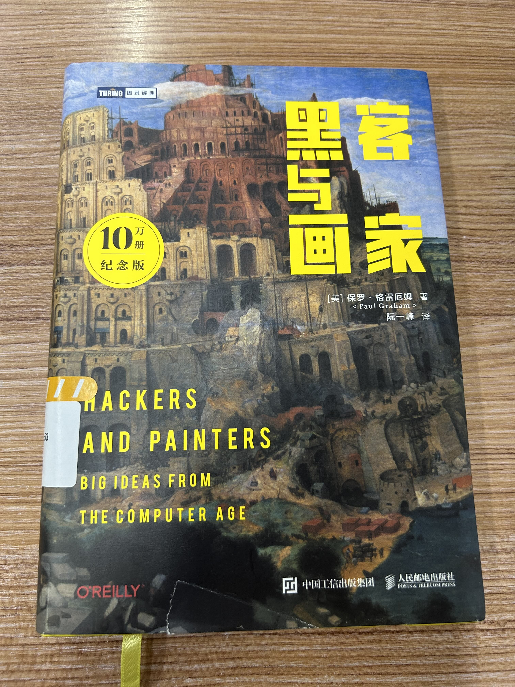

# 黑客与画家

August 2024

> 作者：保罗·格雷厄姆
>
> 译者：阮一峰

在图书馆寻觅这本书的过程可谓是一波三折，第一次寻着图书编号找却没找到，后来又去那个教室翻翻看看，瞟了一眼背后的书架，嘿，书就在那里呢！真所谓"蓦然回首，那书就在灯火阑珊处"。

作者和译者的博客我都非常喜欢，[Paul Graham](https://paulgraham.com)简洁而深刻的文章常常带给我启发，也在[阮一峰的网络日志](https://www.ruanyifeng.com)上学到很多实用技巧。当然，《黑客与画家》这本书是我意料之中的精彩。这里记录了一些喜欢的句子。

## 00 译者序

什么是黑客？麻省理工“铁路模拟俱乐部”把难题的解决方法称为hack，解决问题的人就叫hacker。引申到对某个程序或设备进行修改，hacker被当做计算机入侵者的称呼。为了澄清“黑客”的概念，约定将恶意入侵计算机系统的人称为cracker

## 01 为什么书呆子不受欢迎

书呆子=聪明=不受欢迎

我真正想要的是，能够设计奇妙的火箭、写出漂亮的文章、理解编程原理。一句话，我想要做伟大的事情。

成功需要不间断的付出。

与此同时，社会发生了什么变化？我们被迫面对一个更严峻的问题。它与当前的其他许多难题有着共同的起因，那就是“专业化”（specialization）。当工作的专业程度越来越高时，我们就必须接受更长时间的训练。

没有外在的对手，孩子们就互相把对方当作对手。

## 02 黑客与画家

黑客：开发优美的软件。优美的软件并不总是论文的合适题材。

科研：原创性+能产生大量成果

创造优美事物的方式往往不是从头做起，而是在现有成果的基础上做一些小小的调整，或者将已有的观点用比较新的方式组合起来。很难用论文表达。

读研究生期间，我潜意识里一直有一种很不舒服的感觉，觉得自己应该多学一点理论，不应该期末考试结束还不到三个星期，就把所有东西忘得一干二净，那样真是不可饶恕。现在，我意识到自己错了。

---

举例来说，我在大学受到的教育是，在上机编程之前，应该先在纸上把程序搞清楚。可我自己一直不是这样编程的，我喜欢直接坐在计算机前编程，而不是在纸上编程。更糟的是，我不是耐心地一步步写出整个程序，确保大体上是正确的，而是一股脑地不管对错，先把代码堆上去，再慢慢修改。书上说，调试是最后的步骤，用来纠正打字错误和疏忽。可是我的工作方法看上去却像编程就是在调试。

很长一段时间内我都为此事沮丧，就像小学里老师教我怎么拿铅笔，我却总是学不会的那种感觉。如果我那时看到其他创作领域，比如绘画或者建筑，我就会想到，自己的方法其实有一个正式的名称：打草稿。我现在认为，大学里教给我的编程方法都是错的。你把整个程序想清楚的时间点，应该是在编写代码时，而不是在编写代码之前，这与作家、画家和建筑师的做法完全一样。

明白这一点对软件设计有重大影响。它意味着，编程语言首要的特性应该是允许动态扩展。编程语言是用来帮助思考程序的，而不是用来表达你已经想好的程序。它应该是一支铅笔，而不是一支钢笔。如果大家都像学校教的那样编程，那么静态类型是一个不错的概念。但是，我认识的黑客，没有一个人喜欢用静态类型语言编程。我们需要的是一种可以随意涂抹、擦擦改改的语言，我们不想正襟危坐，把一个盛满各种变量类型的茶杯，小心翼翼放在自己的膝盖上，为了与一丝不苟的编译器大婶交谈，努力地挑选词语，确保变量类型匹配，好让自己显得礼貌又周到。

---

在他们（大公司）看来，“黑客”的工作就是用软件实现某个功能，而不是设计软件。黑客的作用仅仅是实现那个委员会的设计。

真正竞争软件设计的战场是新兴领域的市场，这里还没有人建立过防御工事。

黑客如何才能做自己喜欢的事情？你有一份为了赚钱的工作，还有一份为了爱好的工作。

**开源**软件的这种工作模式可能就是正确的模式。

黑客学习编程主要通过自己写程序。应该定期地从头开始，而不要长年累月地在一个项目上不断工作，并且试图把所有的最新想法都以修订版的形式包括进去。

我对待代码的认真程度远远超过我对待其他事情。

正确的合作方法是将项目分割成严格定义的模块，每一个模块由一个人明确负责。模块与模块之间的接口经过精心设计，如果可能的话，最好把文档说明写得像编程语言规范那样清晰。

程序必须写得能够供人们阅读，偶尔供计算机执行。

## 03 不能说的话

自由思考比畅所欲言更重要。

守口如瓶，笑脸相迎。

## 05 另一条路

应用服务供应商：将软件运行在服务器上（而非传统地在桌面上）

互联网软件运行在服务器上，用户界面就是网页。对于普通用户来说，这种新型软件将更容易、更便宜、更机动、更可靠，通常也比桌面软件更强大。

==用户的胜利==

- 你应该可以从任何计算机上（更准确的说法是终端）获取你的数据

- 软件将与操作系统彻底无关，无需考虑安装问题

- 不用担心升级，少很多bug（没有版本的概念）

- 利于团队协作

- 数据会更安全，硬盘损坏的风险由运营承担，而他们都会备份数据

- 不容易感染病毒。客户端只运行一个浏览器，病毒运行的概率就比较小，本机的数据不会遭到破坏。服务器运营会特别防护病毒对服务器的攻击

==代码之城==

- 互联网软件是许多不同种类程序的集合，而不是一个单独的巨大的二进制文件。设计桌面软件就像设计一幢大楼，而设计互联网软件就像设计一座城市

- 控制服务器，可以要求用户安装相关硬件，以增加功能	
- 可以用任何语言

==软件发布==

- 开发者修改起来非常方便。（桌面软件）发布新版本前，你可能会修改和更换一半的代码，从而又引入无数新的bug，接着，质量监控人员开始测试新代码。

-		不需要承诺发布日期，因为没有版本的概念

==bug==

- 能再现大部分的bug，用户的数据都在你的硬盘上，不必像开发桌面软件那样苦苦猜测到底发生了什么事情

- 在自己刚刚写好的代码中，找出bug往往会比较快，因为潜意识已经在担心某个地方可能会出错；而处理6个月前的bug很麻烦，因为你对代码已经不熟悉了

-		减少复合式bug，小bug会被立刻清理

==全身心投入==

-		写完就可以立刻看到效果

-		计划这个词，只是将构思束之高阁的另一种表达方式。只要想到好的构思，我们就会立刻着手实现

==金钱问题==

- 用户使用盗版，你并没有任何损失，相反，你的市场影响力增大了，而这个用户可能毕业后就会购买你的软件

==目标客户==

- 价格歧视增加收益

- 公司内部所有不直接感受到竞争压力的部门都应该外包出去

- 把个人和小企业客户放在第一位，其他的客户该来的时候就会来

创业中让人望而却步的两件事：

-	不懂得管理企业

-	害怕竞争

解决：

- 管理企业

-		做出用户喜欢的产品

-			用户永远是对的

-		保证开支小于收入

## 06 如何创造财富

我们这个世界，你向下沉沦或者向上奋进都取决于你自己，不能把原因推给外界。

财富不等于金钱

一个大学毕业生总是想“我需要一份工作”，更直接的表达方式应该是“你需要去做一些人们需要的东西”。

一次开发，普遍适用

一开始就选择较难的问题，此后的各种决策都选择较难的那个选项。（这是很好的处事原则）

## 07 关注贫富分化

我认为有三个原因使得我们对赚钱另眼相看：第一，我们从小对财富的看法是被误导的；第二，历史上积累财富的方式大多名声不好；第三，担心收入差距拉大将对社会产生不利影响。就我所知，第一点是错的，第二点已经过时了，第三点通不过现实的检验。

财富是创造出来的。

每个人的技能不同，导致收入不同，这才是贫富分化的主要原因。

如果富人不购买普通汽车，而是购买全手工制作、售价高达几十万美元一辆的豪华车，对他反而不利。因为对于汽车公司来说，生产那些销量很大的普通汽车要比生产那些销量很小的豪华车更有利可图，所以汽车公司会在普通车辆上投入更多的精力和资金，进行设计和制造。如果你购买专为你一个人定制的汽车，质量反而不可靠，某个部件肯定会出问题。这样做的唯一意义就是告诉别人你有能力这样做。

一块普通的石英表反而比几十万美元的机械表走时更准。如果你一定要把钱花在手表上，结果只能给你带来更多的麻烦：处了时间精度下降以外，机械表还必须上发条。

你要避免的是绝对贫穷，而不是相对贫穷。

## 08 防止垃圾邮件的一种方法

贝叶斯过滤：（大概思路）统计正常邮件和垃圾邮件中词语的出现频率，就可以一个一个词属于正常邮件和垃圾邮件的概率。

## 09 设计者的品味

好设计是简单的，永不过时的，解决主要问题的，启发性的，艰苦的，看似容易，对称，模仿大自然，能够复制，成批出现的，大胆的设计。

做出优秀作品的秘诀就是：非常严格的品味，再加上实现这种品味的能力。

如果你工作得不艰苦，你可能正在浪费时间。

## 10 编程语言解析

机器语言、汇编语言->高级语言

编译器处理的高级语言代码又叫做源码。它经过翻译以后产生的机器码就叫做目标码。购买的软件往往得到目标码（相当于被加密了），后来出现了开放源码的软件。

开源的优势：

-	自己动手解决bug

-	更多人的参与

操作系统：Windows未开源，Linux、FreeBSD开源

==语言==

Fortran, Lisp, Cobol, Basic, C, Pascal, Smalltalk, C++, Java, Perl, Python

-	C是低层次语言，大多数操作系统用C写，接近机器，快

-	Java：防止程序员干蠢事，美国国防部很看重

==面向对象编程 VS 传统==

-		问题：计算二维图形面积

-		传统：判断遇到的是什么图形->用相应的公式计算面积

- 面向对象编程 ：写两个类，圆形和正方形，在每个类里用一小块代码（称为方法）计算该类图形的面积。求面积的时候，询问要用那个类，再使用相应的方法。

-		面向对象的优点：修改程序只用增加一块相应的代码

## 11 百年后的编程语言

编程语言的组成：

-	基本运算符的集合

-	除运算符的其他部分

一种语言的内核设计得越小、越干净，它的生命力就越顽强。

AI并没有取得太大进展。一百年后，人们还是使用与现在差不多的程序指挥计算机。

随着技术的发展，每一代人都在做上一代人觉得很浪费的事情。（例：30年前的人看到我们随意打长途电话）

浪费程序员的时间而不是浪费机器的时间才是真正的无效率。

在应用软件与硬件之间设置很多的软件层。

设计新语言的方法之一就是直接写下你想写的程序，不管编译器是否存在，也不管有没有支持它的硬件。这就是假设存在无限的资源供你支配。（但是要尽量克服已有语言对我们思维方式的塑造）

## 12 拒绝平庸

Lisp

-	适合快速开发软件，软件运行在服务器端，写完代码就能发布出去

-	比竞争对手更快地写出新功能，开发周期很短

-	抽象层次高，不需要庞大的开发团队

-	没有宏，那些语言怎么编程呢？Lisp的宏独一无二，与括号有关

viaweb可以让用户在几分钟内搭建起漂亮的网店

## 14 梦寐以求的编程语言

**简洁 可编程性 一次性程序**

影响语言流行的因素：一种语言必须是某一个流行计算机系统的脚本语言

如果你想设计一种流行的编程语言，就不能只是单纯地设计语言本身，还必须为它找到一个依附的系统，而这个系统也必须流行。

书店是程序员发现和学习新语言的最重要的场所之一。

整洁：内核由数量不多的运算符构成，各司其职

混乱：允许黑客以自己的方式使用

最优秀的大型程序是从一次性程序发展出来的。

为了写出优秀软件，你必须同时具备两种互相冲突的信念。一方面，你要像初生牛犊一样，对自己的能力信心万丈；另一方面，你又要像历经沧桑的老人一样，对自己的能力抱着怀疑态度。在你的大脑中，有一个声音说“千难万险只等闲”，还有一个声音却说“早岁那知世事艰”。

## 15 设计与研究

设计与研究的区别看来就在于，前者追求“好”，后者追求“新”。

如果目标用户群体涵盖了设计师本人，那么最有可能诞生优秀设计。

士气是设计的关键因素。先做出原型，再逐步加工出成品，这种方式有利于鼓舞士气，因为它使得你随时都可以看到工作的成效。