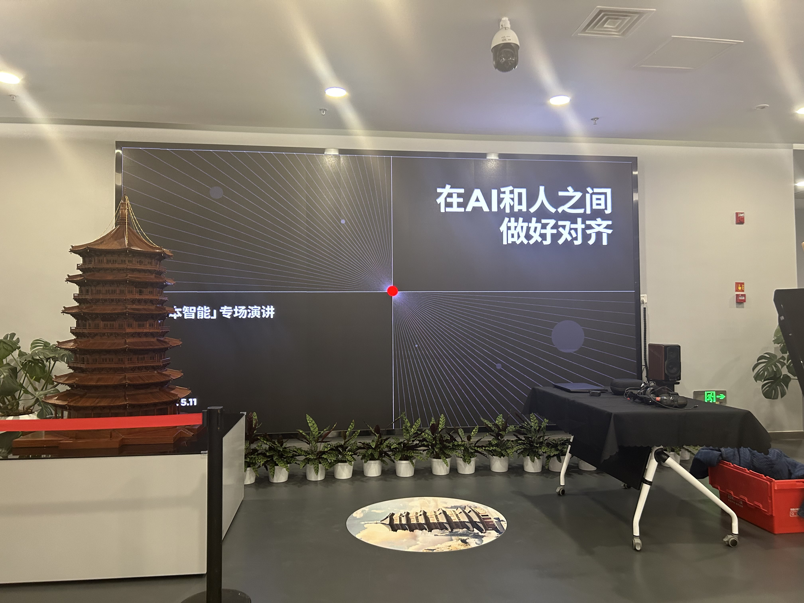
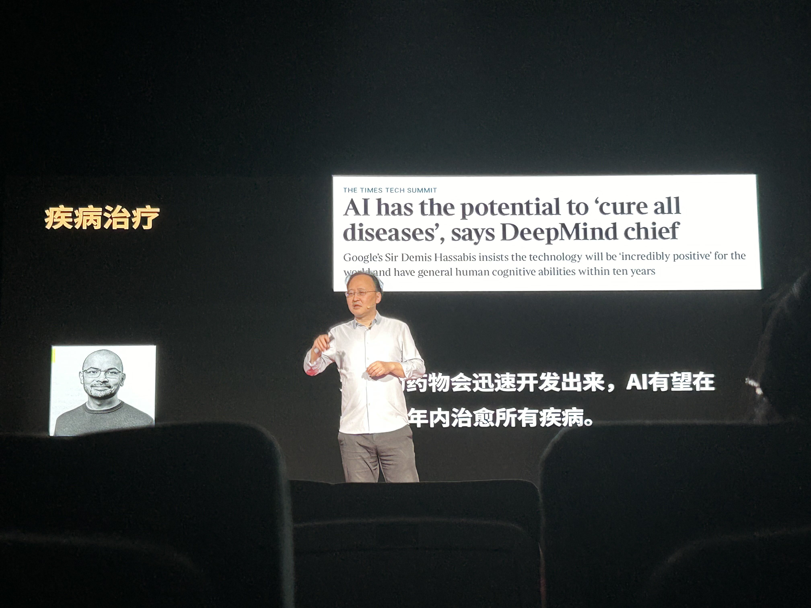
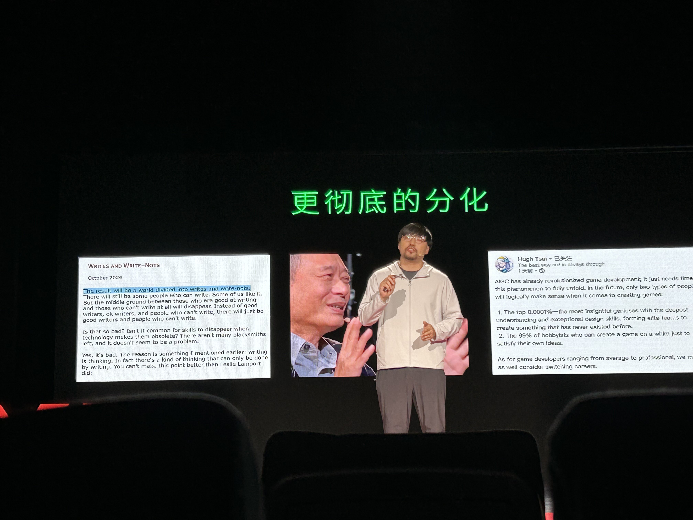

# 一席北京｜在AI和人之间做好对齐

25/05/18 SUN ☀️

上个周末去听了一席北京场的演讲，主题是“人本智能”。核心是“人”，号召大家在关注理性的时候也要关注感性的东西。

（ps. 虽然上周有一堆事儿，比如OO作业啦，ML上机啦，但是一年北京可能也就一次，而且这次的主题我也非常感兴趣的，还是报名了🤩）

刘嘉老师讲了AI的可能应用方向。比如AI辅助教学，有研究表明，AI高度参与课堂时，学生的学习效率有显著提高，课余生活也更丰富。我自己也有这样的感觉，当我把学习资料发给AI，他就会帮我总结出重点，遇到不会的问题还可以询问他，实时而高效。另一个方向是医疗，AI有望在十年内治愈所有疾病 (Google DeepMind CEO)，或许是通过类似诺奖的蛋白质预测研究出更多药物？听上去非常令人振奋。还有数字永生。

> 打个响指吧，他说。
>
> 遥远的事物将被震碎。
>
> 面前的人们此时尚不知情。
>
> ——《漫长的季节》

我们享受AI的便利的时候，也不可避免地产生这样的疑虑，技术这么厉害，人怎么办？首先是AI与整个人类的“对抗”，就像我们的祖先智人利用智慧和欺骗战胜了体格强于自身的尼安德特人，那比人类聪明的AI是否甘愿屈服于人类呢？

其次是AI会加大人与人之间的差异。LLM对专业性的要求会变高，类比助理与医生，助理给出诊断建议，医生确认。赵汗青老师说，会产生更彻底的分化，thinks and think-nots，重要的是，成为信息整合能力强的人，维度高的人。就跟相机没有取代画师一样，AI也不会取代创作者，相机背后思考的眼睛是不一样的，审美是不同的。“创作的同权不等于同质”。

举例说未来的电影，可以让人和电影直接交互，在一些节点上，不同的人为主角做出不同的选择，感觉和游戏一样。

相信AI能为我们带来更多改变，能见证LLM的发展甚至亲身参与研究也是一件很酷的事情。但同时要关注人本身。“在AI和人之间做好对齐”，从自己出发，创造自己的认知体系，不要被动地接受、适应，而是主动地去引导。
$$
---分割线1---
$$
在后半场的时候回学校了，只看了录播。😪

吴翼老师主要讲了AI偏见。

AI也有和人类一样的弱点——存在偏见，即在特定的场景下，大模型过度自信。

- 对抗样本（adversarial example）。这些图片被人为地加上了微小的篡改，人眼看起来觉得没有什么区别，但是却给AI输出带来很大变化。
- 通用AI可以接受的输入范围太广了，可以输入任何像素组成的图片、任何由文字或者符号组成的序列。但是在训练AI的时候，我们用的是人类产生的自然语言，以及真实世界的照片。这个范围是远远小于AI可以接受的范围的。

AI偏见的原因

- 模型的缺陷，过度自信
- 不完美的数据（训练自动驾驶AI，让AI学习好的司机的驾驶方式，好的司机，踩刹车和踩油门的变化不会太多，AI最后学到的是“看一下上一帧是什么动作，这一帧我还做一样的”）
- 算法
- 幻觉，不懂但是胡说八道。让AI学会说不知道？——强化学习

$$
---分割线2---
$$

另外有听友摘录了王俊老师的部分演讲内容，深有共鸣，遂记于此。

> 意义的空泛不是说完全没有意义，而是我们只有一个意义。被科学的进步、更新浸泡久了。对于人和人之间，最基本的理解、倾听、共情、面对面对话缺少了。所以人们的意志、欲望、情感和感受都被消解了。
>
> 时间加速：现代时间是工作和休闲。古代时间是节日，节气，时辰。所以我们不仅没有了可以终身受用的价值和理想，也失去了可以维系一生的职业家庭和爱情。开始了漠无差别的领会，即时反应和情绪都没了，倾听和理解也被量化抽象了。
>
> 在数字时代，存在很多不幸的生活经验，例如，个体常感到生命力被掏空、共同体充满塑料感、时间加速流转、人与人之间交流增多但孤独感强烈、个体被内卷价值观裹挟等。意义的空乏不是说我们今天的生活完全没有意义，而是我们只有唯一的意义。这个意义是由科学意识形态所提供的，我们相信科学是单向进步的，随着经验的不断积累，研究的不断推进，科学会越来越好；今天不能解决的难题、无法医治的病症，明天一定会解决。这是科学意识形态带来的一种进步信仰，在这种信仰下，我们追求无上限的更新、更快、更强，也就是所谓的优绩主义。
>
> 当优绩主义变成唯一的价值标准时，其实是非常危险的。因为这种意义系统的弹性非常有限，它的包容度非常低——只有那些在优绩主义中达到顶端的人才配享有这个意义系统，不然就会被抛弃。如果你在工作和学习中无法达到优绩的顶端，那么你就不配享有任何愉悦感和成就感，你就会感到无限的郁闷。人类似乎只有内卷和躺平两种选择。
>
> 技术发展使心灵退化，人们缺乏把握整体意义的能力和深刻的感受能力，面对人工智能时代，人应如何理解自身成为首要问题。我们需要营建一个多元价值的社会，而不能只有一套评判标准。真正的良好生活不仅仅是径直地投入附近的生活，而是建立在对于支配我们生活行为的底层观念的认知和反思基础之上。